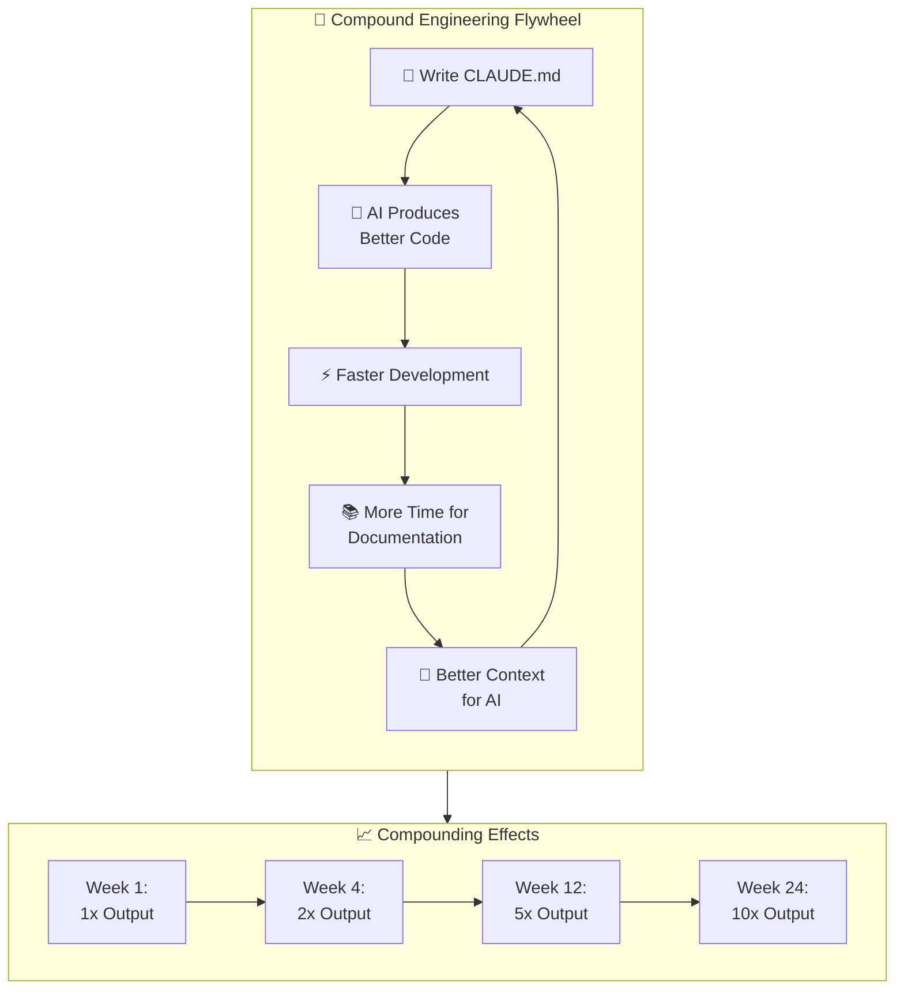

# Chapter 1: The Compound Engineering Flywheel

## Diagram Description
The flywheel showing how compound engineering creates increasing returns over time.

## Mermaid Code

## Usage
This diagram should appear early in Chapter 1 to visualize the core concept of compound engineering.
