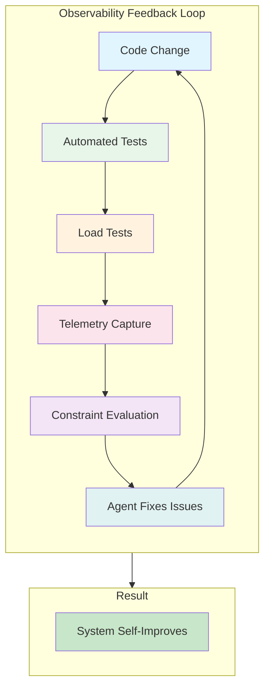
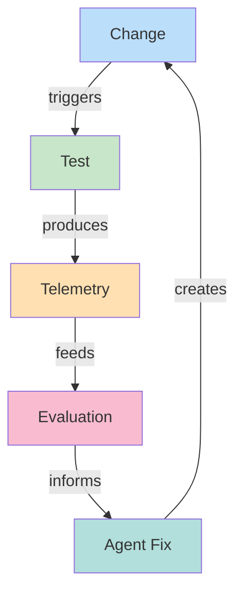
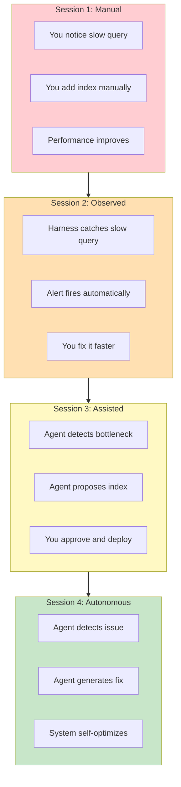
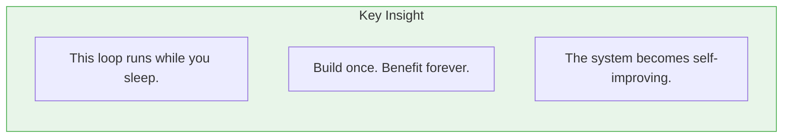

# Chapter 1: The Feedback Loop of Observability

## Diagram Description

This diagram shows how observability creates compound leverage through automated feedback loops. Each stage feeds into the next, creating a cycle that runs continuously. The key insight: once built, this loop operates autonomously while you focus on higher-level work.

**PRD Reference:** Diagram 6 - "How Observability Creates Leverage"

## Primary View: The Feedback Cycle

## Alternative View: Detailed Stage Breakdown

```mermaid
flowchart LR
    subgraph Stage1["Stage 1: Change"]
        A1["Engineer commits code"]
        A2["PR triggers pipeline"]
    end

    subgraph Stage2["Stage 2: Verify"]
        B1["Unit tests run"]
        B2["Integration tests run"]
        B3["Load tests execute"]
    end

    subgraph Stage3["Stage 3: Observe"]
        C1["OTEL traces captured"]
        C2["Metrics aggregated"]
        C3["Logs structured"]
    end

    subgraph Stage4["Stage 4: Evaluate"]
        D1["Constraints checked"]
        D2["Violations flagged"]
        D3["Bottlenecks identified"]
    end

    subgraph Stage5["Stage 5: Fix"]
        E1["Agent proposes fix"]
        E2["Fix verified"]
        E3["Change committed"]
    end

    Stage1 --> Stage2 --> Stage3 --> Stage4 --> Stage5
    Stage5 -.-> Stage1

    style Stage1 fill:#e3f2fd
    style Stage2 fill:#e8f5e9
    style Stage3 fill:#fff8e1
    style Stage4 fill:#fce4ec
    style Stage5 fill:#e0f7fa
```

## Simple View: Core Cycle

## Time Progression View

Shows how the loop evolves over multiple iterations.

## Key Insight Box

## Component Details

| Stage | Input | Output | Tooling |
|-------|-------|--------|---------|
| Code Change | Developer commits | New code in repo | Git, GitHub |
| Automated Tests | Code changes | Pass/fail results | Jest, pytest, CI/CD |
| Load Tests | Test scenarios | Performance data | k6, Artillery |
| Telemetry Capture | Runtime events | Traces, metrics, logs | OTEL, Jaeger, Prometheus |
| Constraint Evaluation | Telemetry data | Violation reports | Custom rules, Prometheus alerts |
| Agent Fixes | Violation data | Proposed fixes | Claude, agent harnesses |

## Investment vs. Return

| Investment | Time | Return |
|------------|------|--------|
| Set up OTEL tracing | 1-2 days | Instant bottleneck visibility |
| Add constraint rules | 1 day | Automated violation detection |
| Build agent integration | 2-3 days | Automatic fix proposals |
| **Total** | **4-6 days** | **Autonomous optimization** |

The loop pays for itself after catching 2-3 issues automatically.

## Usage Notes

- Place this diagram in Section 4.2 (Constraints as the Unit of Design) or Section 4.3 (Observability as Leverage)
- Emphasize the progression from manual to autonomous across sessions
- The "runs while you sleep" tagline captures the core value proposition
- Connect to Chapter 2 (Building the Harness) for implementation details

## Cross-References

- **Chapter 2:** Detailed harness implementation
- **Chapter 6:** Verification ladder concepts
- **Chapter 10:** RALPH loop (similar autonomous iteration pattern)
- **Appendix:** OTEL setup and constraint definition examples
