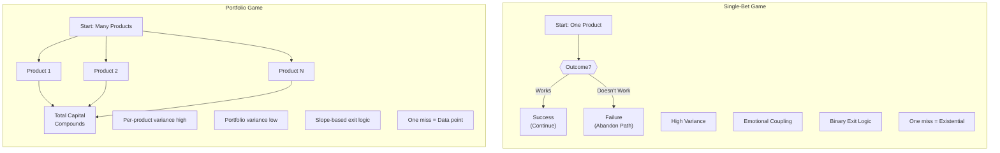
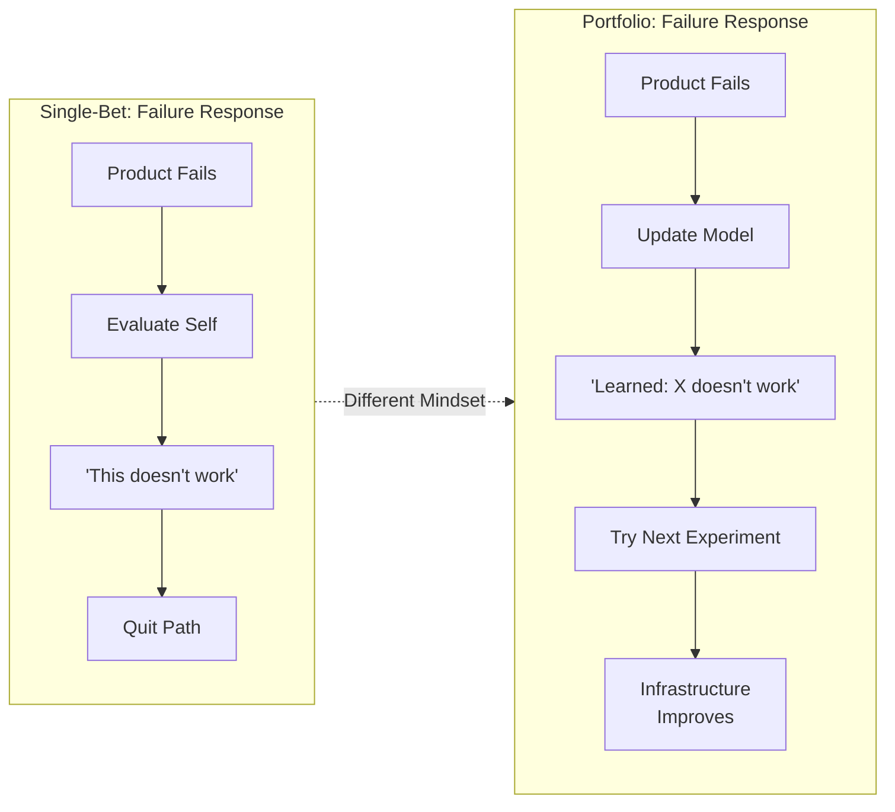
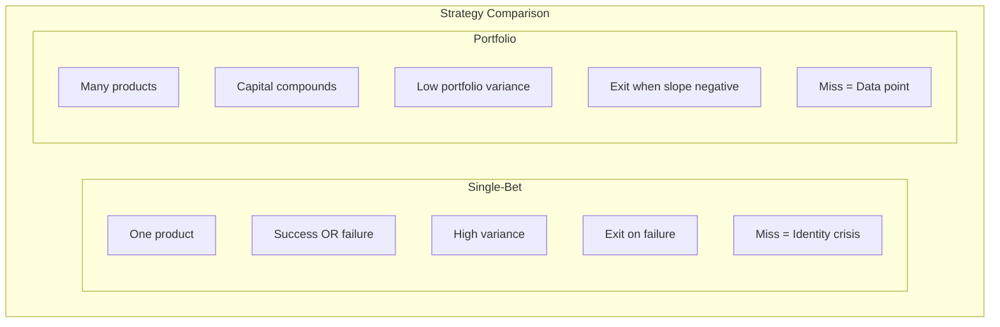
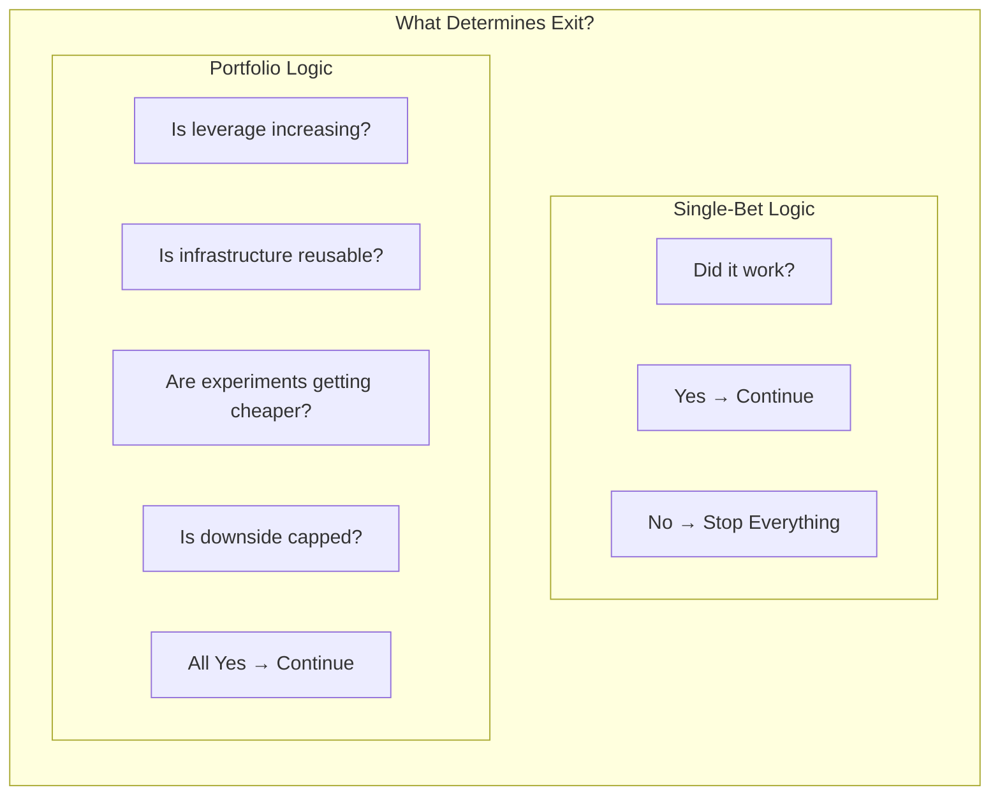

# Chapter 1: Portfolio Game vs Single-Bet Game

## Diagram Description
A comparison visualization showing the two different approaches to independent engineering work. The single-bet approach treats each product as an all-or-nothing gamble, while the portfolio approach treats each product as one data point in a larger investment strategy. The key insight is that in portfolio mode, failures become learning data rather than existential crises.

## Mermaid Code

## Alternative: Failure Response Comparison

## Simple Table View

## Key Metric Comparison

## Usage
This diagram should appear in the "Portfolio Game vs. Single-Bet Game" section (around lines 98-105 of Chapter 1). It visualizes the fundamental difference in how compound systems engineers approach their work versus how most people approach independent projects. Use the first diagram for the primary comparison, and the alternative views to emphasize the different responses to failure.

## Context from Chapter
The chapter explains:
- Single-bet game: "one product, one outcome determines success or failure. Variance is extremely high. Your emotional state is tightly coupled to results. Exit logic is binary: success or failure, nothing between."
- Portfolio game: "many products, total capital compounds. Variance is high per product but low across the portfolio. Expected value depends on infrastructure reusability and learning velocity. Exit logic depends on slope: continue while leverage is increasing."

The key insight: "In single-bet mode, one miss feels existential. In portfolio mode, one miss is data."
