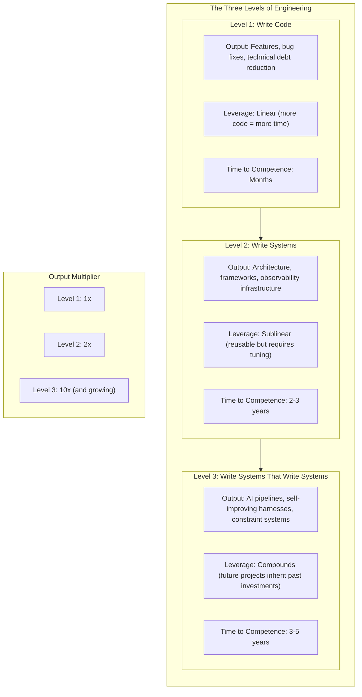
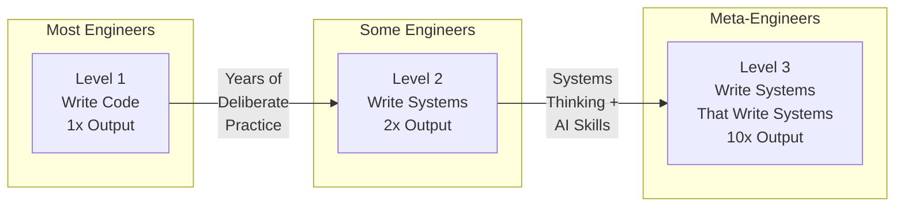
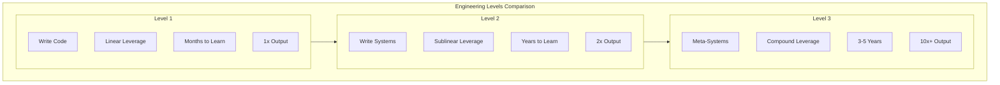

# Chapter 1: The Three Levels of Engineering

## Diagram Description
A pyramid visualization showing the three levels of engineering work, from Level 1 (most common) at the base to Level 3 (meta-engineering) at the top. Each level shows the type of output, leverage characteristics, and time to competence.

## Mermaid Code

## Alternative: Horizontal Pyramid View

## Simple Table View

## Usage
This diagram should appear in the "Three Levels of Engineering" section (around line 55-66 of Chapter 1). It visualizes the core progression from writing code to writing systems to writing systems that write systems. Use the first diagram for detailed presentations, or the alternative views for simpler inline references.

## Context from Chapter
The chapter explains:
- Level 1: Most engineers stop here. Output is features and bug fixes. Leverage is linear.
- Level 2: Some engineers reach this level. Output is architecture and frameworks. Leverage becomes sublinear.
- Level 3: Meta-engineers operate here. Output is AI pipelines and self-improving systems. Leverage compounds.

The key insight: "You have probably been operating at Level 1. You can reach Level 2 within a few years. Level 3 is where the game fundamentally changes."
