# Chapter 2: Agent vs Chat Mental Model

## Diagram Description
A comparison visualization showing the fundamental difference between chat-based LLM interaction (ChatGPT-style) and agent-based interaction (Claude Code). The chat path shows isolated, passive text exchange while the agent path shows active codebase interaction with read/write/execute capabilities.

## Mermaid Code

```mermaid
flowchart TB
    subgraph Chat["Chat Mode (ChatGPT)"]
        direction TB
        C1["👤 Developer copies code into chat"]
        C2["💬 LLM generates text response"]
        C3["👤 Developer manually applies suggestions"]
        C4["🔄 Repeat if needed"]

        C1 --> C2 --> C3 --> C4
        C4 -.->|"Manual iteration"| C1
    end

    subgraph Agent["Agent Mode (Claude Code)"]
        direction TB
        A1["📂 Agent reads codebase directly"]
        A2["🧠 Agent reasons about patterns"]
        A3["✏️ Agent modifies files"]
        A4["⚡ Agent runs commands"]
        A5["👁️ Agent observes results"]

        A1 --> A2 --> A3 --> A4 --> A5
        A5 -.->|"Automatic iteration"| A2
    end

    subgraph Result["Outcome"]
        R1["Chat: You do the work"]
        R2["Agent: AI does the work"]
    end

    Chat --> R1
    Agent --> R2
```

## Alternative: Capability Comparison View

## Alternative: Information Flow View

## Simple Table View

## Usage
This diagram should appear early in Chapter 2, in the "The Agent Mindset" section (around lines 9-24). It visualizes why the shift from "ask it to write code" to "ask it to solve a problem given context" matters.

The primary diagram shows:
- Chat: Manual, iterative, you-do-the-work loop
- Agent: Automatic, read-reason-act-verify loop

## Context from Chapter
The chapter opens with: "Claude Code is not ChatGPT in a terminal. It is an agent: a tool that reads your codebase, makes changes, runs commands, and reasons iteratively about what to do next."

The key insight is the mindset shift:
- **Chat mindset**: "I'll ask it to write code" → requires you to apply, verify, iterate
- **Agent mindset**: "I'll ask it to solve a problem given context" → it reads, acts, verifies

This is why the same underlying LLM produces dramatically different results: context access and action capability change everything.
