# Chapter 2: Claude Code Tool Ecosystem

## Diagram Description
A radial visualization showing Claude Code's seven core tools organized by function: understanding (Read, Glob, Grep), action (Write, Edit, Bash), and observation (Console/Results). The agent sits at the center, with a continuous feedback loop showing how tools connect to form the autonomous reasoning cycle.

## Mermaid Code

## Alternative: Circular Flow View

```mermaid
flowchart LR
    subgraph Cycle["Agent Reasoning Cycle"]
        direction TB

        U["1. UNDERSTAND<br/>Read • Glob • Grep"]
        R["2. REASON<br/>Pattern matching<br/>Decision making"]
        A["3. ACT<br/>Write • Edit • Bash"]
        O["4. OBSERVE<br/>Console output<br/>Test results"]

        U --> R --> A --> O
        O -->|"Loop until done"| U
    end
```

## Alternative: Tool Categories Breakdown

```mermaid
flowchart TB
    subgraph InputTools["Input Tools (Read the World)"]
        direction TB
        R1["📄 Read"]
        R1D["Fetch file contents<br/>Learn patterns<br/>Understand architecture"]

        G1["🔍 Glob"]
        G1D["Find files by name<br/>Pattern matching<br/>Discovery"]

        GR1["📝 Grep"]
        GR1D["Search content<br/>Find function calls<br/>Trace dependencies"]

        R1 --- R1D
        G1 --- G1D
        GR1 --- GR1D
    end

    subgraph OutputTools["Output Tools (Change the World)"]
        direction TB
        W1["✏️ Write"]
        W1D["Create new files<br/>Tests, configs, docs<br/>Full file generation"]

        E1["🔧 Edit"]
        E1D["Modify existing code<br/>Surgical changes<br/>Preserve context"]

        B1["⚡ Bash"]
        B1D["Run commands<br/>Tests, builds, lints<br/>Infrastructure ops"]

        W1 --- W1D
        E1 --- E1D
        B1 --- B1D
    end

    subgraph FeedbackTools["Feedback Tools (Learn from Results)"]
        direction TB
        O1["👁️ Observe"]
        O1D["Console output<br/>Test failures<br/>Build errors<br/>Command results"]

        O1 --- O1D
    end

    InputTools -->|"Inform"| Agent2["🧠 Agent"]
    Agent2 -->|"Execute"| OutputTools
    OutputTools -->|"Produce"| FeedbackTools
    FeedbackTools -->|"Feed back"| Agent2
```

## Alternative: When to Use Each Tool

```mermaid
flowchart TB
    subgraph WhenToUse["When to Use Each Tool"]
        direction LR

        subgraph Understanding2["Understanding Phase"]
            UT1["Read → Learning patterns"]
            UT2["Read → Before editing"]
            UT3["Glob → Finding files"]
            UT4["Grep → Finding usage"]
        end

        subgraph Action2["Action Phase"]
            AT1["Write → New files only"]
            AT2["Edit → Existing files"]
            AT3["Bash → Tests & builds"]
        end

        subgraph Feedback2["Feedback Phase"]
            FT1["Observe → Verify changes"]
            FT2["Observe → Debug failures"]
        end
    end
```

## Simple Reference Table

```mermaid
flowchart TB
    subgraph ToolReference["Seven Core Tools Reference"]
        direction TB

        subgraph Input["INPUT"]
            I1["Read: Fetch contents"]
            I2["Glob: Find by pattern"]
            I3["Grep: Search contents"]
        end

        subgraph Output["OUTPUT"]
            O1["Write: Create files"]
            O2["Edit: Modify files"]
            O3["Bash: Run commands"]
        end

        subgraph Feedback["FEEDBACK"]
            F1["Observe: See results"]
        end
    end

    Input -->|"Understand"| Center["🧠 Agent"]
    Center -->|"Act"| Output
    Output -->|"Results"| Feedback
    Feedback -->|"Learn"| Center
```

## Usage

This diagram should appear in Chapter 2, section "The Tool Ecosystem" (around line 148). It visualizes:

1. **The seven core tools** Claude Code has access to
2. **Tool categories**: Input (understand), Output (act), Feedback (observe)
3. **The feedback loop** that makes agents effective: understand → reason → act → observe → understand

The key insight: Claude Code is not just generating text. It has tools to read your codebase, make changes, run commands, and verify results. This creates an autonomous feedback loop where the agent can iterate until the task is done.

## Context from Chapter

The chapter describes seven core tools:

1. **Read** - Fetch file contents to understand patterns, architecture, implementation
2. **Write** - Create new files (tests, configs, documentation)
3. **Edit** - Surgical changes to existing code, replacing specific text blocks
4. **Glob** - Discover files matching patterns (agent-friendly find)
5. **Grep** - Full-text regex search across codebase
6. **Bash** - Run CLI commands: build, test, lint, deploy
7. **Observability** - Console output, test results, build output (feedback)

The tools are grouped by function:
- **Understanding tools** (Read, Glob, Grep): How the agent learns about your code
- **Action tools** (Write, Edit, Bash): How the agent modifies your code
- **Feedback tools** (Observe): How the agent verifies its changes worked

This grouping shows why Claude Code is an agent, not a chatbot: it has a complete perceive-think-act-observe loop.
