# Chapter 2: Two-Mode Mental Model

## Diagram Description
A visualization showing the two-mode workflow pattern that separates exploration from implementation. The diagram contrasts the "without exploration" approach (trial and error, multiple iterations) with the "with exploration" approach (understand first, implement correctly). This pattern is the most important distinction between beginners and productive practitioners.

## Mermaid Code

```mermaid
flowchart TB
    subgraph Without["Without Exploration (Beginner Pattern)"]
        direction TB
        W1["📝 Vague prompt"]
        W2["❓ Claude guesses patterns"]
        W3["❌ Code doesn't match"]
        W4["🔄 Iterate 3-4 times"]
        W5["⏱️ 30 min, 800 lines"]

        W1 --> W2 --> W3 --> W4 --> W5
        W4 -.->|"Rework"| W2
    end

    subgraph With["With Exploration (Expert Pattern)"]
        direction TB

        subgraph Explore["Mode 1: Explore (5 min)"]
            E1["🔍 How does X work?"]
            E2["📖 Show me patterns"]
            E3["💡 Build understanding"]
        end

        subgraph Implement["Mode 2: Implement (2 min)"]
            I1["📋 Reference patterns"]
            I2["✅ First-try correct"]
            I3["⏱️ 7 min, 200 lines"]
        end

        E1 --> E2 --> E3 --> I1 --> I2 --> I3
    end

    subgraph Outcome["Results"]
        O1["Without: 30 min, frustration"]
        O2["With: 7 min, working code"]
    end

    Without --> O1
    With --> O2
```

## Alternative: Time Investment View

## Alternative: Mode Characteristics View

```mermaid
flowchart TB
    subgraph ExploreMode["Exploration Mode"]
        direction TB
        EM1["Goal: Build Understanding"]
        EM2["Questions:"]
        EM3["• How is X implemented?"]
        EM4["• What patterns exist?"]
        EM5["• Show me an example"]
        EM6["Outcome: Landscape known"]

        EM1 --> EM2 --> EM3 --> EM4 --> EM5 --> EM6
    end

    subgraph ImplementMode["Implementation Mode"]
        direction TB
        IM1["Goal: Correct First Try"]
        IM2["Approach:"]
        IM3["• Reference discoveries"]
        IM4["• Include file paths"]
        IM5["• Define success criteria"]
        IM6["Outcome: Working code"]

        IM1 --> IM2 --> IM3 --> IM4 --> IM5 --> IM6
    end

    ExploreMode -->|"Then"| ImplementMode
```

## Alternative: Decision Flow View

```mermaid
flowchart TB
    Start["Starting New Work"]

    Q1{"Familiar with\nthis code?"}

    subgraph ExploreFirst["Explore First"]
        EF1["New feature?"]
        EF2["Unfamiliar code?"]
        EF3["Evaluating approaches?"]
        EF4["Debugging unclear issue?"]
        EFA["→ Use Exploration Mode"]
    end

    subgraph ImplementDirect["Implement Directly"]
        ID1["Patterns known?"]
        ID2["Repeating established work?"]
        ID3["Explicit examples available?"]
        IDA["→ Use Implementation Mode"]
    end

    subgraph Both["Use Both Modes"]
        B1["Complex feature"]
        B2["Explore architecture"]
        B3["Then implement informed"]
    end

    Start --> Q1
    Q1 -->|"No"| ExploreFirst
    Q1 -->|"Yes"| ImplementDirect
    Q1 -->|"Partially"| Both

    EF1 --> EF2 --> EF3 --> EF4 --> EFA
    ID1 --> ID2 --> ID3 --> IDA
    B1 --> B2 --> B3
```

## Simple Reference Table

## Usage
This diagram should appear in the "The Two-Mode Mental Model" section of Chapter 2 (lines 337-399). It visualizes the core productivity pattern: separate exploration from implementation.

The primary diagram shows:
- Without exploration: trial and error, 30 min, frustration
- With exploration: understand first, 7 min, working code

The key metrics referenced in the chapter:
- 23 minutes saved
- 75% fewer lines generated
- 60% fewer iterations
- 8x fewer pattern violations

## Context from Chapter

Key passages from lines 337-399:

"The single most important pattern for productive agent work is separating exploration from implementation."

"Without exploration, code generation is a lottery. You ask Claude Code to implement a feature, it generates code, and you discover it does not match your patterns... Total time: 30 minutes, 800 lines generated, significant frustration."

"With exploration, you first ask questions... After 5 minutes, you understand the landscape. Then you ask for implementation with informed context. Claude Code generates correct code on the first try. Total time: 7 minutes, 200 lines, working code."

"The difference: 23 minutes saved, 75% fewer lines generated, first-try correctness."

Exploration mode questions:
- "How is [feature] currently implemented?"
- "What patterns should I follow?"
- "Show me an example."

When to use each mode:
- Exploration: new features, unfamiliar codebases, evaluating approaches, debugging unclear issues
- Implementation: you understand the patterns, repeating established work, have explicit examples to follow
- Both: complex features
