# Chapter 3: The Constraint Funnel

## Diagram Description
Visualizes how each layer of constraints progressively reduces the solution space (entropy) from millions of possibilities to a handful of correct solutions. This is the core mental model for understanding why constraints improve code generation quality.

## Primary Mermaid Diagram

```mermaid
flowchart TB
    subgraph Funnel["🔽 The Constraint Funnel"]
        direction TB

        A["All Syntactically Valid Programs\n📊 ~1,000,000 possibilities"]
        B["+ Type Constraints\n📊 ~10,000 possibilities\n(Type-safe programs only)"]
        C["+ Format Constraints\n📊 ~1,000 possibilities\n(Consistent structure)"]
        D["+ Behavior Constraints\n📊 ~100 possibilities\n(Tests pass)"]
        E["+ Style Constraints\n📊 ~10 possibilities\n(Matches your codebase)"]
        F["Optimal Solution\n📊 1-3 valid outputs\n(Production ready)"]

        A --> B --> C --> D --> E --> F
    end

    style A fill:#ff6b6b,color:#000
    style B fill:#ffa06b,color:#000
    style C fill:#ffd06b,color:#000
    style D fill:#d0ff6b,color:#000
    style E fill:#6bff9f,color:#000
    style F fill:#6bffff,color:#000
```



## Alternative: Entropy Reduction View

```mermaid
flowchart LR
    subgraph Before["Without Constraints"]
        H1["High Entropy\n🎲 Many equally likely outputs\n🎲 Most are wrong\n🎲 Unpredictable results"]
    end

    subgraph Process["Add Constraints"]
        P1["Each constraint\neliminates invalid\npossibilities"]
    end

    subgraph After["With Constraints"]
        L1["Low Entropy\n✓ Few possible outputs\n✓ Most are correct\n✓ Predictable results"]
    end

    Before --> Process --> After

    style Before fill:#ff6b6b
    style After fill:#6bff9f
```



## Alternative: Constraint Type Examples


## Alternative: Before/After Comparison

```mermaid
flowchart TB
    subgraph Unconstrained["Unconstrained Generation"]
        U1["Prompt: Add validation"]
        U2["Possible outputs:\n• Any error pattern\n• Any library\n• Any file structure\n• Any test approach"]
        U3["Result: Generic code\nthat doesn't fit project"]
    end

    subgraph Constrained["Constrained Generation"]
        C1["Prompt: Add validation\n+ Use Zod\n+ Return Result<T, E>\n+ Match src/validators/\n+ Include tests"]
        C2["Possible outputs:\n• Zod schema only\n• Result return type\n• Existing file pattern\n• Test coverage"]
        C3["Result: Project-specific\ncode that fits perfectly"]
    end

    U1 --> U2 --> U3
    C1 --> C2 --> C3

    style U3 fill:#ff6b6b
    style C3 fill:#6bff9f
```



## Numerical Reduction Table

| Layer | Constraint Type | Remaining Possibilities | Reduction Factor |
|-------|-----------------|------------------------|------------------|
| 0 | None | ~1,000,000 | - |
| 1 | Type constraints | ~10,000 | 100x |
| 2 | Format constraints | ~1,000 | 10x |
| 3 | Behavior constraints (tests) | ~100 | 10x |
| 4 | Style constraints | ~10 | 10x |
| **Total** | **All layers** | **~1-3** | **~1,000,000x** |

## Usage
This diagram should appear in section 3.3 "Constraint-Based Prompting" (around lines 207-223 of chapter 3). It visualizes the chapter's key metaphor of constraints as a funnel that progressively narrows valid solutions.

Use the primary funnel diagram for the main explanation, the entropy reduction view for a simpler mental model, or the constraint type examples when showing readers what kinds of constraints to add.

## Context from Chapter

The chapter explains the funnel concept with this passage:

> "Think of constraints as a funnel. Each constraint eliminates possible outputs:"
>
> ```
> All syntactically valid programs         [1,000,000 possibilities]
>     ↓ Type constraints
> Type-safe programs                       [10,000 possibilities]
>     ↓ Format constraints
> Consistently formatted programs          [1,000 possibilities]
>     ↓ Behavior constraints (tests)
> Correct programs                         [100 possibilities]
>     ↓ Style constraints
> Programs matching your codebase          [10 possibilities]
> ```
>
> "Each layer reduces entropy by an order of magnitude. The result: predictable, correct, maintainable code."

Key insight from the chapter:
> "The underlying principle is entropy reduction. Every prompt you send creates a probability distribution over possible outputs. Vague prompts produce high entropy: many equally likely outputs, most of them wrong. Precise prompts produce low entropy: few possible outputs, most of them correct."
