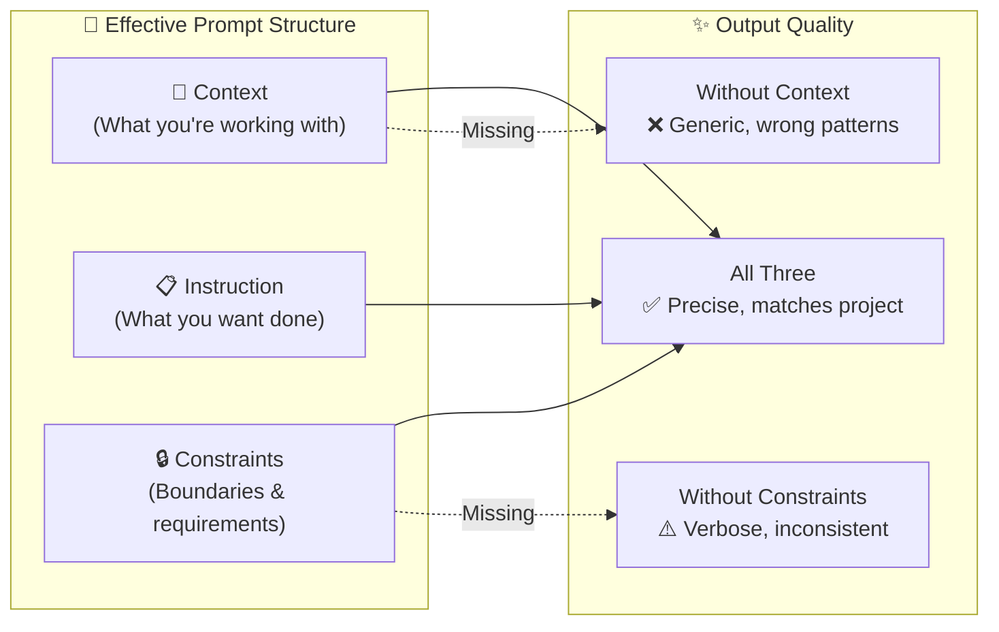
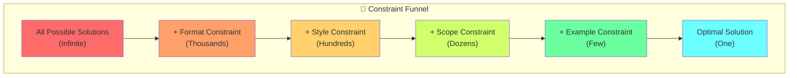

# Chapter 3: Anatomy of an Effective Prompt

## Diagram Description
Shows the three parts of an effective prompt and how they affect output quality.

## Mermaid Code

```mermaid
flowchart LR
    subgraph Prompt["📝 Effective Prompt Structure"]
        direction TB
        A["🎯 Context\n(What you're working with)"]
        B["📋 Instruction\n(What you want done)"]
        C["🔒 Constraints\n(Boundaries & requirements)"]
    end

    subgraph Output["✨ Output Quality"]
        D["Without Context\n❌ Generic, wrong patterns"]
        E["Without Constraints\n⚠️ Verbose, inconsistent"]
        F["All Three\n✅ Precise, matches project"]
    end

    A --> F
    B --> F
    C --> F

    A -.->|"Missing"| D
    C -.->|"Missing"| E
```

## Constraint Funnel Diagram

```mermaid
flowchart TB
    subgraph Funnel["🔽 Constraint Funnel"]
        A["All Possible Solutions\n(Infinite)"]
        B["+ Format Constraint\n(Thousands)"]
        C["+ Style Constraint\n(Hundreds)"]
        D["+ Scope Constraint\n(Dozens)"]
        E["+ Example Constraint\n(Few)"]
        F["Optimal Solution\n(One)"]

        A --> B --> C --> D --> E --> F
    end

    style A fill:#ff6b6b
    style B fill:#ffa06b
    style C fill:#ffd06b
    style D fill:#d0ff6b
    style E fill:#6bff9f
    style F fill:#6bffff
```
