# Chapter 3: Anatomy of an Effective Prompt

## Diagram Description
Shows the three essential components of an effective prompt (context, instruction, constraints) and how each component affects output quality. Illustrates why vague prompts produce generic code while complete prompts produce project-specific solutions.

## Primary Mermaid Diagram


## Alternative: Weak vs Strong Prompt Comparison

```mermaid
flowchart LR
    subgraph Weak["❌ Weak Prompt"]
        W1["Add user validation\nto the API"]
        W2["Missing:\n• Where? (which file)\n• What pattern?\n• What errors?\n• How to test?"]
    end

    subgraph Strong["✅ Strong Prompt"]
        S1["Add validation to\ncreateUser endpoint\nin src/api/users.ts"]
        S2["Context:\n• Use Zod schemas\n• Follow src/utils/validation.ts\n• Return Result<T, E>"]
        S3["Constraints:\n• RFC 5322 email\n• Min 8 char password\n• Add JSDoc\n• Add tests"]
    end

    subgraph Results["Results"]
        R1["Generic code\n5+ iterations\nDoesn't fit project"]
        R2["Project-specific code\n1 iteration\nProduction ready"]
    end

    W1 --> R1
    W2 --> R1
    S1 --> R2
    S2 --> R2
    S3 --> R2

    style R1 fill:#ff6b6b
    style R2 fill:#6bff9f
```



## Alternative: Component Details Table

```mermaid
flowchart TB
    subgraph Table["Prompt Component Reference"]
        direction TB

        subgraph Context["Context Component"]
            C1["✓ Relevant files"]
            C2["✓ Existing patterns"]
            C3["✓ Domain knowledge"]
            C4["✓ Dependencies"]
        end

        subgraph Instruction["Instruction Component"]
            I1["✓ Specific action"]
            I2["✓ Target location"]
            I3["✓ Expected output"]
            I4["✓ Success criteria"]
        end

        subgraph Constraint["Constraint Component"]
            CN1["✓ Format rules"]
            CN2["✓ Behavior rules"]
            CN3["✓ Scope limits"]
            CN4["✓ Performance reqs"]
        end
    end
```



## Simple Flow View


## Usage
This diagram should appear in section 3.1 "The Anatomy of an Effective Prompt" (around lines 9-49 of chapter 3). It helps readers understand why their prompts sometimes produce great results and sometimes produce garbage. The key insight: missing components cause specific failure modes.

Use the primary diagram for full explanation, the comparison view to show concrete before/after examples, or the simple flow view for a quick reference.

## Context from Chapter

The chapter introduces prompt anatomy with this key passage:

> "Every effective prompt has three components: context, instruction, and constraints."
>
> - **Context** tells the LLM what exists and what matters. It includes relevant files, existing patterns, and domain knowledge.
> - **Instruction** tells the LLM what to do. It specifies the action, the location, and the expected output.
> - **Constraints** tell the LLM what boundaries to respect. They narrow the solution space by eliminating invalid approaches.

The weak prompt example from the chapter:
```
Add user validation to the API
```

The strong prompt example from the chapter:
```
Add validation to the createUser endpoint in src/api/users.ts

Context:
- Validation patterns are in src/utils/validation.ts
- Use Zod for schema validation
- Return Result<T, ValidationError>, never throw

Constraints:
- Validate email format (RFC 5322)
- Validate password (min 8 chars, requires number)
- Include JSDoc comments
- Add tests in tests/api/users.test.ts
```
