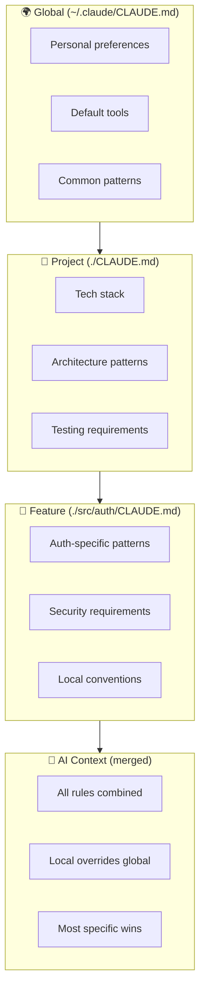
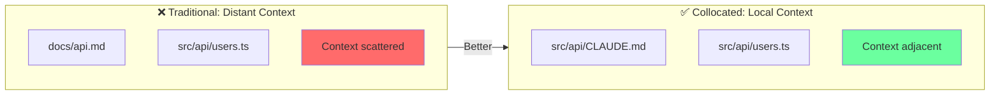

# Chapter 4: CLAUDE.md Hierarchy

## Diagram Description
Shows how CLAUDE.md files inherit and layer context across a project.

## Mermaid Code

```mermaid
flowchart TB
    subgraph Global["🌍 Global (~/.claude/CLAUDE.md)"]
        G1["Personal preferences"]
        G2["Default tools"]
        G3["Common patterns"]
    end

    subgraph Project["📁 Project (./CLAUDE.md)"]
        P1["Tech stack"]
        P2["Architecture patterns"]
        P3["Testing requirements"]
    end

    subgraph Feature["📂 Feature (./src/auth/CLAUDE.md)"]
        F1["Auth-specific patterns"]
        F2["Security requirements"]
        F3["Local conventions"]
    end

    Global --> Project --> Feature

    subgraph Context["🤖 AI Context (merged)"]
        C1["All rules combined"]
        C2["Local overrides global"]
        C3["Most specific wins"]
    end

    Feature --> Context
```

## Collocation Pattern

```mermaid
flowchart LR
    subgraph Traditional["❌ Traditional: Distant Context"]
        A1["docs/api.md"]
        A2["src/api/users.ts"]
        A3["Context scattered"]
    end

    subgraph Collocated["✅ Collocated: Local Context"]
        B1["src/api/CLAUDE.md"]
        B2["src/api/users.ts"]
        B3["Context adjacent"]
    end

    Traditional -->|"Better"| Collocated

    style A3 fill:#ff6b6b
    style B3 fill:#6bff9f
```
