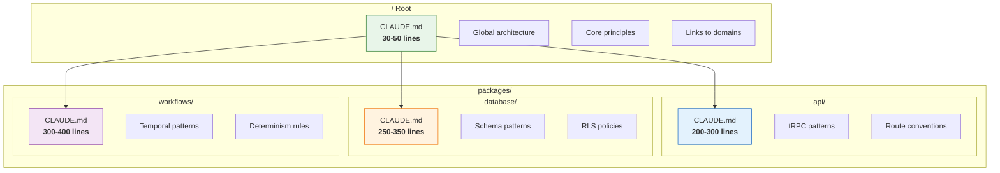
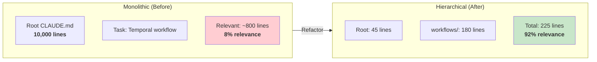
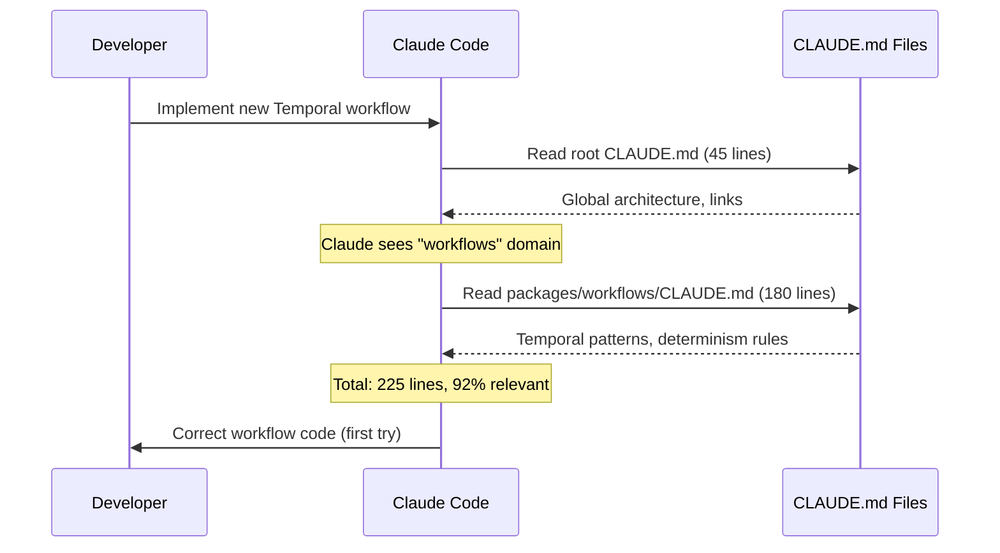
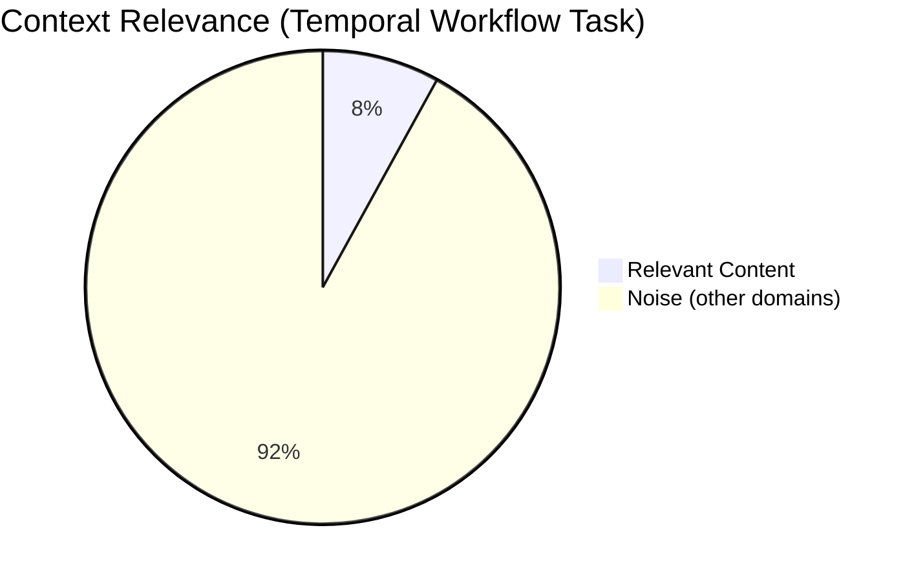
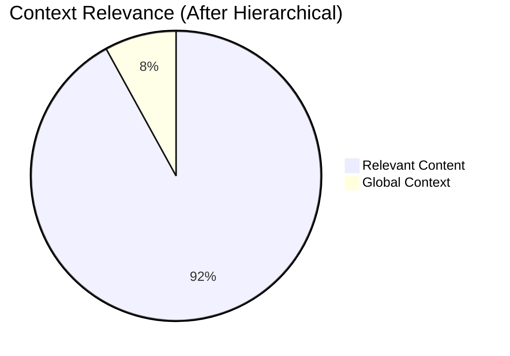

# Chapter 4: Hierarchical CLAUDE.md for Scaling

## Diagram Description
Shows how hierarchical CLAUDE.md files distribute documentation across a codebase to achieve high context relevance instead of monolithic loading.

## Primary View: Tree Structure with Line Counts

## Alternative View: Monolithic vs Hierarchical Comparison

## Alternative View: Context Loading for Specific Task

## Alternative View: File Size Guidelines

| Level | Target Lines | Maximum | Purpose |
|-------|-------------|---------|---------|
| **Root** | 20-50 | 100 | Global architecture, links only |
| **Domain** | 100-200 | 300 | Package-specific patterns |
| **Subdomain** | 50-150 | 200 | Highly specialized areas |

**When to create:**
- Domain file: When patterns diverge between directories
- Subdomain file: When area has unique constraints from parent
- Maximum depth: 3-4 levels

## Alternative View: Relevance Improvement

**Monolithic: 8% relevance**

**Hierarchical: 92% relevance**

## Usage

This diagram appears in **Chapter 4, Section 4.6** (lines 165-218) where hierarchical CLAUDE.md for scaling codebases is explained. It helps readers understand the structure, sizing guidelines, and relevance improvements.

**Suggested placement**: After the problem statement (line 167) and file structure example (line 196).

## Context from Chapter

> "A 10,000-line monolithic CLAUDE.md creates a problem. When implementing a Temporal workflow, the LLM loads 10,000 lines but only 800 matter. The other 9,200 lines about API patterns, database migrations, and React components become noise that dilutes attention."
>
> "The hierarchical approach achieves 70-90% context reduction with 80-95% relevance improvement."
>
> "When working on packages/workflows/src/send-email.ts, Claude loads:
> - Root CLAUDE.md (40 lines)
> - workflows/CLAUDE.md (300 lines)
> - Total: 340 lines, 95%+ relevant"

The diagram visualizes the dramatic improvement from 8% to 92%+ relevance when using hierarchical documentation.
