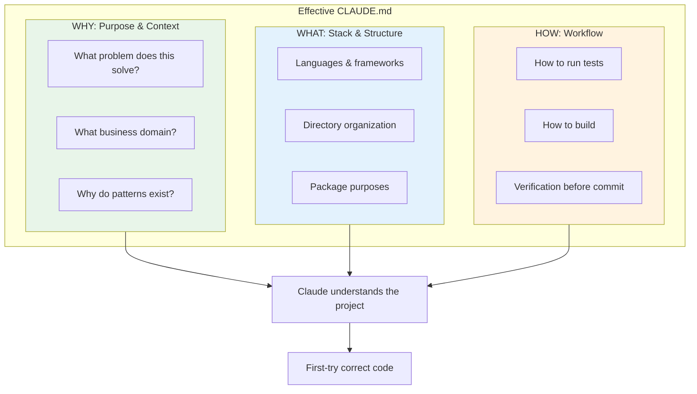
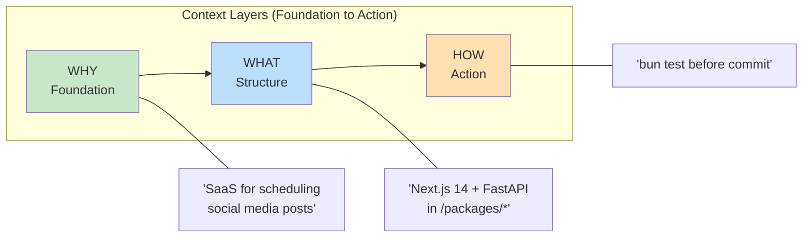
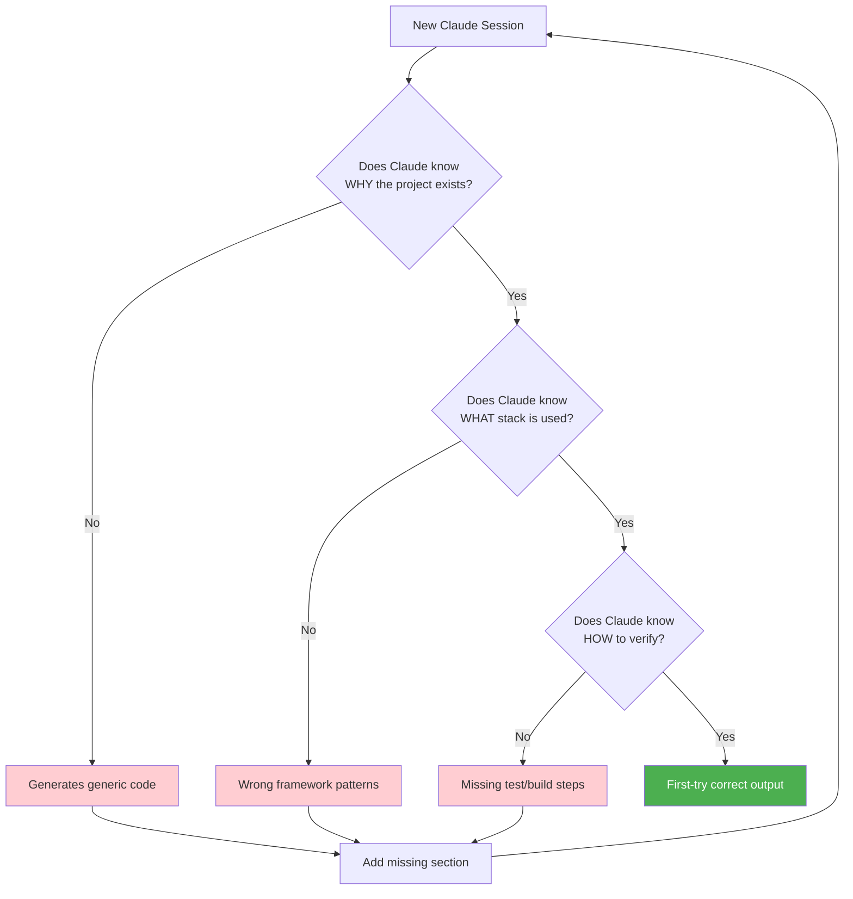

# Chapter 4: WHY-WHAT-HOW Framework

## Diagram Description
Visualizes the three dimensions of effective CLAUDE.md documentation: WHY (purpose), WHAT (structure), and HOW (workflow).

## Primary View: Three Pillars

## Alternative View: Layered Stack

## Alternative View: Question Flow

## Alternative View: Comparison Table

| Dimension | Question Answered | Example Content | Without It |
|-----------|-------------------|-----------------|------------|
| **WHY** | "What does this project do?" | "SaaS for marketers to schedule posts" | Generic code, wrong abstractions |
| **WHAT** | "What technologies?" | "Next.js 14, FastAPI, Supabase" | Wrong framework, wrong paths |
| **HOW** | "How do I verify?" | "Run bun test, then bun build" | Missing verification, broken commits |

## Usage

This diagram appears in **Chapter 4, Section 4.4** (lines 44-84) where the WHY-WHAT-HOW framework is introduced. It helps readers visualize how these three dimensions combine to create effective CLAUDE.md files.

**Suggested placement**: After the framework introduction (line 53) and before the minimal example (line 54).

## Context from Chapter

> "Every effective CLAUDE.md covers three dimensions:
>
> **WHY**: Purpose and context. What problem does this project solve? What business domain does it operate in? Why do certain architectural decisions exist?
>
> **WHAT**: Technology stack and structure. What languages and frameworks does the project use? How is the codebase organized? What packages live where?
>
> **HOW**: Workflow requirements. How do developers run tests? How do they build for production? What verification steps happen before committing?"

The framework ensures Claude has complete context to generate correct code on the first try, avoiding the pattern mismatch corrections described at the chapter opening.
