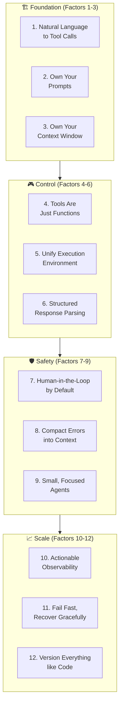
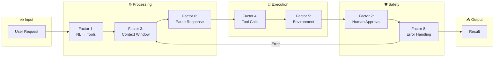

# Chapter 5: 12-Factor Agent Overview

## Diagram Description
Visual overview of the 12 factors for production-ready LLM agents.

## Mermaid Code

```mermaid
flowchart TB
    subgraph Foundation["🏗️ Foundation (Factors 1-3)"]
        F1["1. Natural Language\nto Tool Calls"]
        F2["2. Own Your\nPrompts"]
        F3["3. Own Your\nContext Window"]
    end

    subgraph Control["🎮 Control (Factors 4-6)"]
        F4["4. Tools Are\nJust Functions"]
        F5["5. Unify Execution\nEnvironment"]
        F6["6. Structured\nResponse Parsing"]
    end

    subgraph Safety["🛡️ Safety (Factors 7-9)"]
        F7["7. Human-in-the-Loop\nby Default"]
        F8["8. Compact Errors\ninto Context"]
        F9["9. Small, Focused\nAgents"]
    end

    subgraph Scale["📈 Scale (Factors 10-12)"]
        F10["10. Actionable\nObservability"]
        F11["11. Fail Fast,\nRecover Gracefully"]
        F12["12. Version Everything\nlike Code"]
    end

    Foundation --> Control --> Safety --> Scale
```

## Factor Interaction Map

```mermaid
flowchart LR
    subgraph Input["📥 Input"]
        A["User Request"]
    end

    subgraph Processing["⚙️ Processing"]
        B["Factor 1:\nNL → Tools"]
        C["Factor 3:\nContext Window"]
        D["Factor 6:\nParse Response"]
    end

    subgraph Execution["🔧 Execution"]
        E["Factor 4:\nTool Calls"]
        F["Factor 5:\nEnvironment"]
    end

    subgraph Safety["🛡️ Safety"]
        G["Factor 7:\nHuman Approval"]
        H["Factor 8:\nError Handling"]
    end

    subgraph Output["📤 Output"]
        I["Result"]
    end

    A --> B --> C --> D --> E --> F
    F --> G --> H --> I
    H -->|"Error"| C
```
