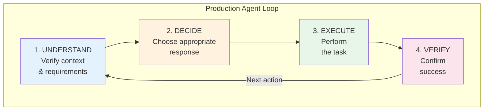
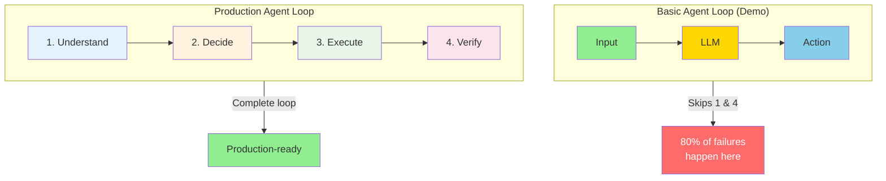
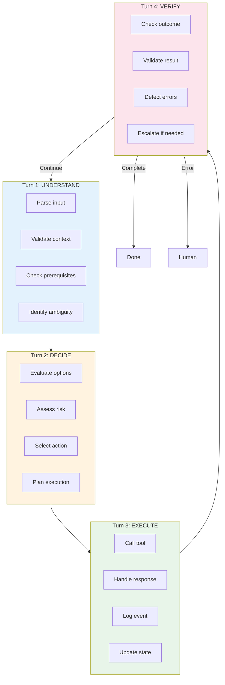
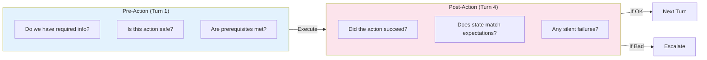

# Chapter 5: Four-Turn Framework

## Diagram Description
Visualizes the production agent loop: Understand, Decide, Execute, Verify. Contrasts with the basic agent loop that skips understanding and verification.

## Primary View: Full Framework

## Alternative View: Demo vs Production Comparison

## Alternative View: Turn Details

## Alternative View: Where Failures Occur

| Turn | Skip Rate in Demos | Failure Impact |
|------|-------------------|----------------|
| 1. Understand | 60% skipped | Misinterprets task, wrong assumptions |
| 2. Decide | 10% skipped | Usually present (LLM does this) |
| 3. Execute | 5% skipped | Usually present (action happens) |
| 4. Verify | 80% skipped | Silent failures, corrupted state |

**Key insight:** Turns 1 and 4 are where 80% of production failures occur, yet demos routinely skip them.

## Alternative View: Verification Focus

## Usage
This diagram appears in Section 5.1 "The Four-Turn Framework" to explain the production agent loop structure.

## Context from Chapter
> "Basic agents run a simple loop: Input, LLM, Action. Production agents need four turns:
> 1. **Understand**: Verify context and requirements
> 2. **Decide**: Choose the appropriate response
> 3. **Execute**: Perform the task
> 4. **Verify**: Confirm success
>
> Most demo agents skip turns 1 and 4. They assume context is clear and trust API responses. This is exactly where 80% of production failures occur."
