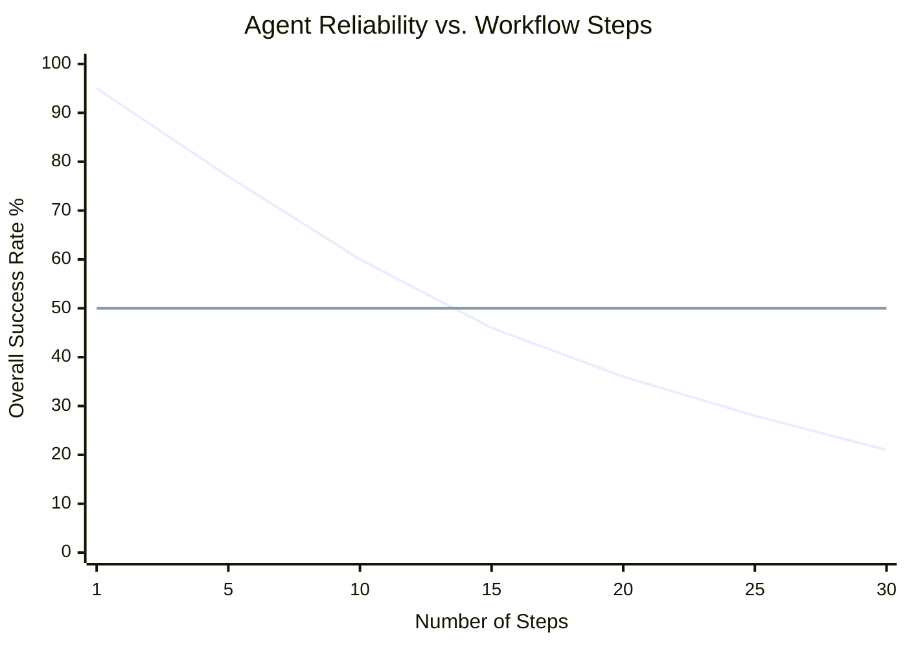
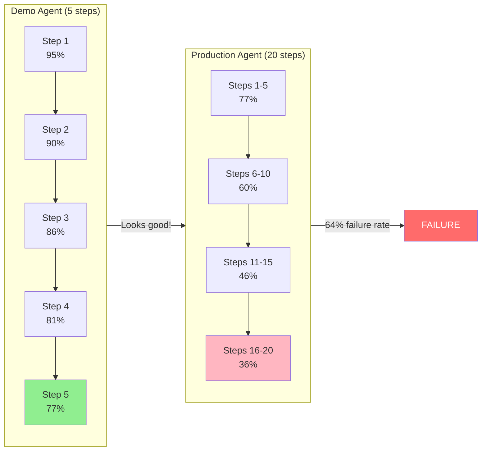
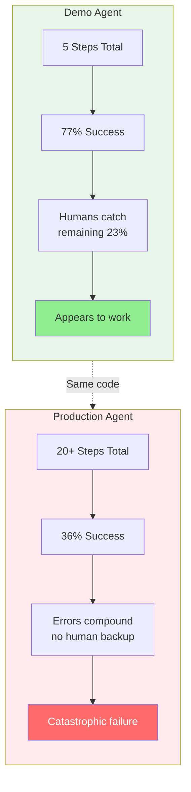
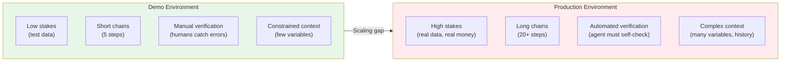

# Chapter 5: Reliability Cascade (The Reliability Chasm)

## Diagram Description
Visualizes the exponential reliability decay in multi-step agent workflows. Shows why demo agents (5 steps) succeed while production agents (20+ steps) fail catastrophically.

## Primary View: Exponential Decay Chart

## Alternative View: Cascade Flowchart

## Alternative View: Reliability Table

| Steps | Per-Step Success | Cumulative | Status |
|-------|-----------------|------------|--------|
| 1 | 95% | 95% | Safe |
| 5 | 95% | 77% | Demo zone |
| 10 | 95% | 60% | Warning |
| 15 | 95% | 46% | Danger |
| 20 | 95% | 36% | Critical |
| 25 | 95% | 28% | Failing |
| 30 | 95% | 21% | Broken |

## Alternative View: Comparison Diagram

## Why Demo Agents Appear Reliable

## Usage
This diagram appears in Section 5.1 "The Reliability Chasm" to explain why 95% of agent PoCs never reach production.

## Context from Chapter
> "The formula is simple: `0.95^N`. A 10-step workflow has 60% reliability, worse than a coin flip for business-critical operations. Production workflows commonly require 15-25 steps."

> "This exponential failure explains why up to 95% of agent proof-of-concepts never reach production."
