# Chapter 6: Verification Ladder Stack

## Diagram Description

Visualizes the six levels of the verification ladder from the chapter. Each level catches different categories of bugs, with higher levels catching progressively rarer but more dangerous issues.

## Primary View: Layered Stack

```mermaid
flowchart TB
    subgraph Ladder["🔬 The Verification Ladder"]
        direction TB
        L6["Level 6: Formal Verification\n(TLA+, Z3)\n'Prove it's impossible to violate'"]
        L5["Level 5: Property-Based Testing\n(fast-check, Hypothesis)\n'Test with thousands of generated inputs'"]
        L4["Level 4: Integration Tests\n'Test components working together'"]
        L3["Level 3: Unit Tests\n'Test individual functions'"]
        L2["Level 2: Runtime Validation\n(Zod, io-ts)\n'Validate data at boundaries'"]
        L1["Level 1: Static Types\n(TypeScript, mypy)\n'Catch errors at compile time'"]

        L6 --> L5 --> L4 --> L3 --> L2 --> L1
    end

    style L6 fill:#9b59b6,color:#fff
    style L5 fill:#3498db,color:#fff
    style L4 fill:#2ecc71,color:#fff
    style L3 fill:#f1c40f,color:#000
    style L2 fill:#e67e22,color:#fff
    style L1 fill:#e74c3c,color:#fff
```

## Alternative View: Cost vs Confidence

## Alternative View: What Each Level Catches

## Alternative View: Decision Table

| Scenario | Minimum Level | Why |
|----------|---------------|-----|
| Internal utility function | Level 3 (Unit tests) | Low risk, logic verification sufficient |
| API endpoint | Level 2 + Level 4 | Schema validation + integration flows |
| Financial calculations | Level 5 (Property tests) | Edge cases can cause real money loss |
| Security-critical code | Level 5 + manual audit | Adversarial inputs, unknown attack vectors |
| Distributed consensus | Level 6 (Formal verification) | Bugs cause system-wide failures |
| Life-critical systems | Level 6 (Formal verification) | Bugs cause physical harm |

## Alternative View: Cumulative Bug Catch Rate

## Usage Notes

- **Primary View**: Use for chapter introduction at line 9-31 to explain the ladder concept
- **Cost vs Confidence**: Reference when discussing the 80% confidence from levels 1-3 (line 280)
- **What Each Level Catches**: Use for deeper explanation of each level's purpose
- **Decision Table**: Matches the decision framework table at lines 271-278
- **Cumulative Bug Catch**: Visualizes the multiplicative effect discussion (lines 449-452)

## Context from Chapter

> "Verification isn't a single check. It's a hierarchy where each level catches what lower levels miss." (line 9)

> "You get 80% confidence from levels 1-3 at low cost. Levels 5-6 give the last 20% but cost 5x more. Choose based on risk tolerance and cost of failure." (line 280)

> "The multiplicative effect: Level 1-3 catches 80% of bugs. Level 5 catches 80% of the remaining 20%. Combined: 80% + (80% × 20%) = 96% total catch rate" (lines 449-452)
