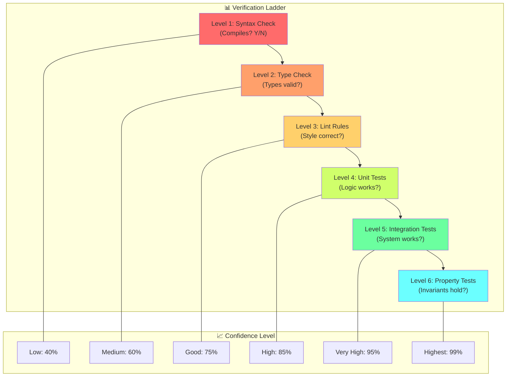
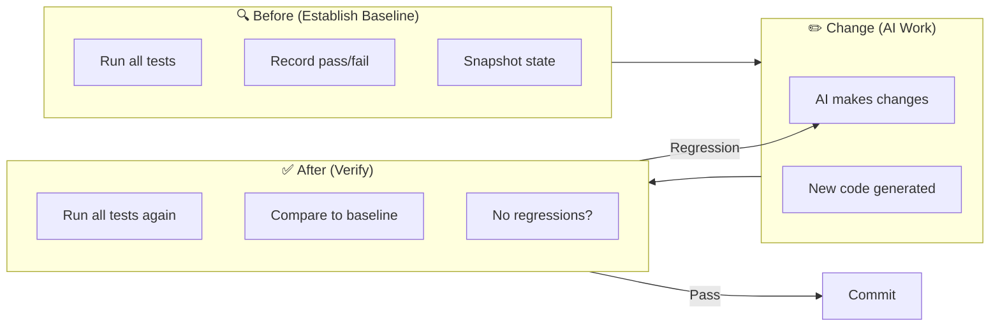

# Chapter 6: The Verification Ladder

## Diagram Description
Six levels of verification from weakest to strongest.

## Mermaid Code

```mermaid
flowchart TB
    subgraph Ladder["📊 Verification Ladder"]
        direction TB
        L1["Level 1: Syntax Check\n(Compiles? Y/N)"]
        L2["Level 2: Type Check\n(Types valid?)"]
        L3["Level 3: Lint Rules\n(Style correct?)"]
        L4["Level 4: Unit Tests\n(Logic works?)"]
        L5["Level 5: Integration Tests\n(System works?)"]
        L6["Level 6: Property Tests\n(Invariants hold?)"]

        L1 --> L2 --> L3 --> L4 --> L5 --> L6
    end

    subgraph Confidence["📈 Confidence Level"]
        C1["Low: 40%"]
        C2["Medium: 60%"]
        C3["Good: 75%"]
        C4["High: 85%"]
        C5["Very High: 95%"]
        C6["Highest: 99%"]
    end

    L1 --- C1
    L2 --- C2
    L3 --- C3
    L4 --- C4
    L5 --- C5
    L6 --- C6

    style L1 fill:#ff6b6b
    style L2 fill:#ffa06b
    style L3 fill:#ffd06b
    style L4 fill:#d0ff6b
    style L5 fill:#6bff9f
    style L6 fill:#6bffff
```

## Verification Sandwich Pattern

```mermaid
flowchart LR
    subgraph Before["🔍 Before (Establish Baseline)"]
        A1["Run all tests"]
        A2["Record pass/fail"]
        A3["Snapshot state"]
    end

    subgraph Change["✏️ Change (AI Work)"]
        B1["AI makes changes"]
        B2["New code generated"]
    end

    subgraph After["✅ After (Verify)"]
        C1["Run all tests again"]
        C2["Compare to baseline"]
        C3["No regressions?"]
    end

    Before --> Change --> After

    After -->|"Regression"| B1
    After -->|"Pass"| D["Commit"]
```
