# Chapter 6: Verification Sandwich Pattern

## Diagram Description

Visualizes the verification sandwich pattern from the chapter. The key insight: run verification before AND after code generation to establish a baseline and detect regressions.

## Primary View: The Sandwich Flow

```mermaid
flowchart TB
    subgraph Pre["1. PRE-VERIFICATION (Baseline)"]
        direction TB
        P1["Run tests"]
        P2["Run type check"]
        P3["Run linter"]
        P1 --> P1R["All pass ✓"]
        P2 --> P2R["Clean ✓"]
        P3 --> P3R["Clean ✓"]
    end

    subgraph Gen["2. GENERATION"]
        G1["Make the code change"]
    end

    subgraph Post["3. POST-VERIFICATION (Delta)"]
        direction TB
        D1["Run tests"]
        D2["Run type check"]
        D3["Run linter"]
        D1 --> D1R["Detect failures"]
        D2 --> D2R["Find errors"]
        D3 --> D3R["Catch issues"]
    end

    Pre --> Gen --> Post

    Pre -->|"FAIL"| Stop["⛔ STOP\nDon't generate on broken baseline"]
    Post -->|"New failures = from change"| Fix["Fix the change"]
    Post -->|"All pass"| Commit["✅ Commit"]

    style Pre fill:#27ae60,color:#fff
    style Gen fill:#3498db,color:#fff
    style Post fill:#9b59b6,color:#fff
    style Stop fill:#e74c3c,color:#fff
    style Commit fill:#2ecc71,color:#fff
```



## Alternative View: Timeline Sequence


## Alternative View: The Key Rule

```mermaid
flowchart LR
    subgraph Rule["🔑 The Key Rule"]
        R1["If pre-verification fails"]
        R2["STOP immediately"]
        R3["Don't generate code on a broken baseline"]
        R1 --> R2 --> R3
    end

    subgraph Benefit["✅ Benefit"]
        B1["Post-verification failures"]
        B2["are GUARANTEED"]
        B3["to be from new code"]
        B1 --> B2 --> B3
    end

    Rule --> Benefit

    style Rule fill:#e74c3c,color:#fff
    style Benefit fill:#27ae60,color:#fff
```



## Alternative View: Verification Script Structure

```
scripts/verify.sh
├── Type checking    (tsc --noEmit)
├── Linting          (npm run lint)
├── Testing          (npm test)
└── Building         (npm run build)

Exit on first failure (set -e)
Run BEFORE and AFTER every code generation
```

## Alternative View: What the Pattern Eliminates

| Without Sandwich | With Sandwich |
|-----------------|---------------|
| Tests fail after change | Tests fail after change |
| Was it the change or pre-existing? | Definitely the change |
| Hours debugging old issues | Zero time on old issues |
| Ambiguous failure attribution | Clear failure attribution |
| "Works on my machine" syndrome | Reproducible baselines |

## Alternative View: State Comparison

```mermaid
flowchart TB
    subgraph Before["Before State"]
        B1["Tests: 47 pass, 0 fail"]
        B2["Types: Clean"]
        B3["Lint: Clean"]
    end

    subgraph Change["Code Change"]
        C1["Added new endpoint"]
        C2["Modified validation"]
    end

    subgraph After["After State"]
        A1["Tests: 45 pass, 2 fail"]
        A2["Types: 1 error"]
        A3["Lint: Clean"]
    end

    subgraph Delta["Delta Analysis"]
        D1["❌ 2 test failures → from change"]
        D2["❌ 1 type error → from change"]
        D3["✅ Lint unchanged"]
    end

    Before --> Change --> After --> Delta
```



## Usage Notes

- **Primary View**: Use for the main explanation at lines 284-334
- **Timeline Sequence**: Use when explaining the workflow to developers
- **Key Rule**: Emphasize the critical insight at line 309
- **Script Structure**: Reference for the bash script at lines 311-332
- **State Comparison**: Illustrate concrete example of delta analysis

## Context from Chapter

> "The verification sandwich solves this." (line 291)

> "The key rule: If pre-verification fails, stop immediately. Don't generate code on a broken baseline." (line 309)

> "Run this before and after every code generation. When pre-verification passes, post-verification failures are guaranteed to be from the new code. No ambiguity. No wasted debugging." (lines 334-335)
