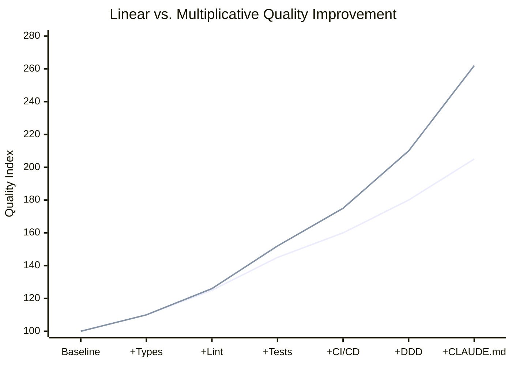
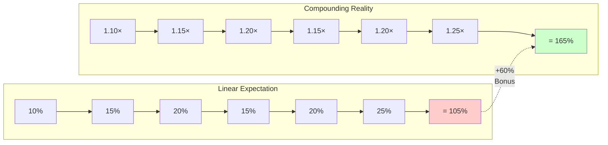
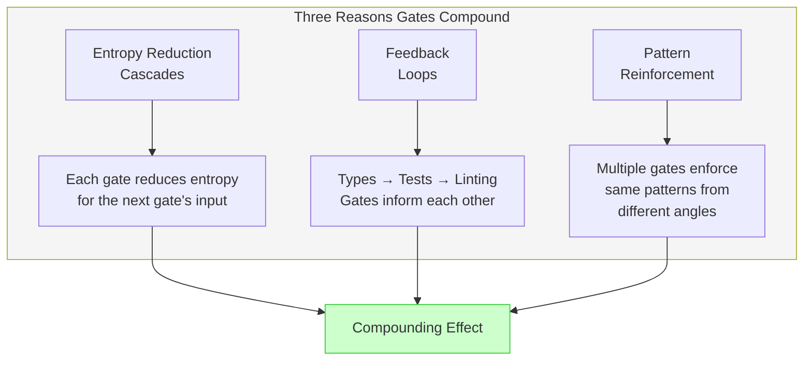

# Diagram: Linear vs. Multiplicative Compounding

## Description
Visualizes the difference between additive (linear) thinking and multiplicative (compounding) reality for quality gates. Shows how six gates produce 165% improvement instead of the 105% that linear thinking predicts, yielding a 60% compounding bonus.

## Primary View: Compounding Comparison Chart



## Alternative View 1: Step-by-Step Calculation

```
LINEAR THINKING (Wrong):
─────────────────────────
Baseline:     100
+ Types 10%:  100 + 10 = 110
+ Lint 15%:   110 + 15 = 125  ← Adding 15 to total, not 15% of 110
+ Tests 20%:  125 + 20 = 145
+ CI/CD 15%:  145 + 15 = 160
+ DDD 20%:    160 + 20 = 180
+ CLAUDE.md:  180 + 25 = 205

Linear result: 205 (105% improvement)


MULTIPLICATIVE THINKING (Correct):
──────────────────────────────────
Baseline:     100
× Types 1.10: 100 × 1.10 = 110.0
× Lint 1.15:  110 × 1.15 = 126.5  ← 15% of current level (110)
× Tests 1.20: 126.5 × 1.20 = 151.8
× CI/CD 1.15: 151.8 × 1.15 = 174.6
× DDD 1.20:   174.6 × 1.20 = 209.5
× CLAUDE.md:  209.5 × 1.25 = 261.9

Multiplicative result: 262 (165% improvement)


COMPOUNDING BONUS:
──────────────────
Multiplicative: 165%
Linear:         105%
Bonus:           60% additional improvement
```

## Alternative View 2: Visual Gap Analysis



## Alternative View 3: The Formula

```
┌─────────────────────────────────────────────────────────────┐
│                                                             │
│   Q_total = (1 + q₁) × (1 + q₂) × ... × (1 + qₙ)           │
│                                                             │
│   Where:                                                    │
│   • q₁, q₂, etc. = individual gate improvement rates        │
│   • Each gate improves the OUTPUT of the previous gate      │
│   • NOT the original baseline                               │
│                                                             │
│   Example with 6 gates:                                     │
│   Q = 1.10 × 1.15 × 1.20 × 1.15 × 1.20 × 1.25 = 2.62       │
│                                                             │
└─────────────────────────────────────────────────────────────┘
```

## Alternative View 4: Why Compounding Happens



## Alternative View 5: Comparison Table

| Gate | Rate | Linear Add | Multiplicative | Gap |
|------|------|-----------|----------------|-----|
| Types | 10% | 100 → 110 | 100 → 110.0 | 0 |
| Linting | 15% | 110 → 125 | 110 → 126.5 | +1.5 |
| Tests | 20% | 125 → 145 | 126.5 → 151.8 | +6.8 |
| CI/CD | 15% | 145 → 160 | 151.8 → 174.6 | +14.6 |
| DDD | 20% | 160 → 180 | 174.6 → 209.5 | +29.5 |
| CLAUDE.md | 25% | 180 → 205 | 209.5 → 261.9 | +56.9 |

**Key insight**: The gap between linear and multiplicative grows with each additional gate. The 6th gate adds 56.9 points more than linear thinking predicts.

## Usage Notes

**Where this appears in chapter**: Section "Why Gates Multiply, Not Add" (lines 134-211)

**Key teaching point**: Each gate improves the output of the previous gate, not the original baseline. This is why multiplication is correct and addition is wrong.

**Common misconception**: "Adding more gates has diminishing returns." Reality: Each gate is MORE valuable than the previous one due to compounding.

## Context from Chapter

From ch07-quality-gates-that-compound.md lines 142-146:
> "But quality gates are actually multiplicative:
> Total improvement = Gate1 × Gate2 × Gate3 × ..."

From ch07-quality-gates-that-compound.md lines 173-177:
> "Linear thinking would predict: 10% + 15% + 20% + 15% + 20% + 25% = 105%
> Compounding reality gives you: 165%
> The bonus from compounding: 60% additional improvement."
