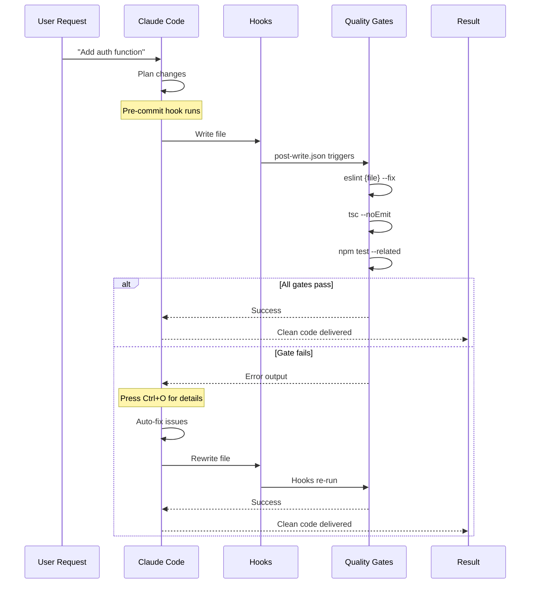
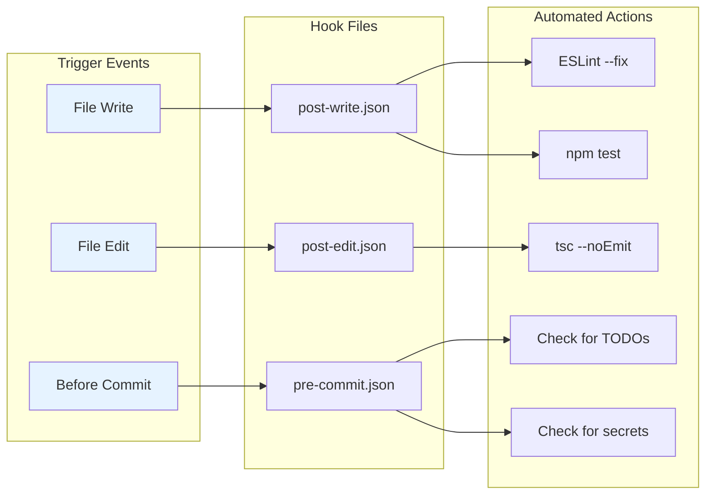
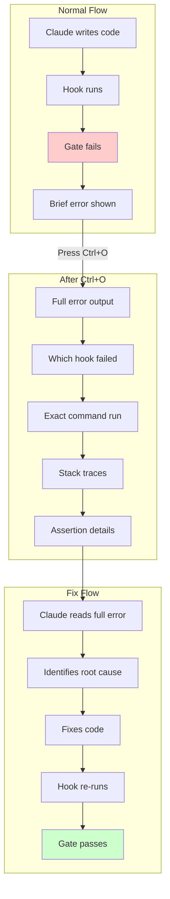

# Diagram: Claude Code Hooks Execution Timeline

## Description
Visualizes how Claude Code hooks automate quality gate verification, turning manual verification cycles into automatic feedback loops. Shows the timeline of hook execution and the Ctrl+O keyboard shortcut for viewing full error output.

## Primary View: Hook Execution Flow



## Alternative View 1: Hook Types and Timing



## Alternative View 2: Manual vs. Automated Workflow

```
MANUAL WORKFLOW (Without Hooks):
────────────────────────────────
1. Claude writes file           [2 sec]
2. You run: npm run lint        [5 sec]
3. Find 5 lint errors
4. Ask Claude to fix            [30 sec]
5. You run: tsc --noEmit        [8 sec]
6. Find 3 type errors
7. Ask Claude to fix            [30 sec]
8. You run: npm test            [15 sec]
9. Find 2 test failures
10. Ask Claude to fix           [30 sec]
11. Repeat steps 2-10...        [???]

Total: 8-10 minutes, 6 manual commands


AUTOMATED WORKFLOW (With Hooks):
────────────────────────────────
1. Claude writes file           [2 sec]
2. Hook runs automatically      [5 sec]
   └─ eslint --fix
   └─ tsc --noEmit
   └─ npm test --related
3. Hook fails? Press Ctrl+O     [1 sec]
4. Claude reads error, fixes    [10 sec]
5. Hook re-runs automatically   [5 sec]
6. Done!                        [0 sec]

Total: 2-3 minutes, 0 manual commands
Savings: 60-70% time reduction
```

## Alternative View 3: Hook Configuration Example

```json
// .claude/hooks/post-write.json
{
  "command": "npx eslint {file} --fix && tsc --noEmit && npm test -- --related {file} --passWithNoTests",
  "description": "Lint, type check, and test in one pass",
  "continueOnError": false
}
```

**Command breakdown**:
| Part | Purpose |
|------|---------|
| `npx eslint {file} --fix` | Auto-fix style issues |
| `&&` | Stop on first failure |
| `tsc --noEmit` | Type check without emitting |
| `npm test -- --related {file}` | Run only related tests |
| `--passWithNoTests` | Don't fail if no tests exist |

## Alternative View 4: Ctrl+O Workflow



## Alternative View 5: Impact Metrics

| Metric | Without Hooks | With Hooks | Improvement |
|--------|--------------|------------|-------------|
| Time per feature | 8-10 min | 2-3 min | 60-70% faster |
| Manual commands | 6 | 0 | 100% automated |
| Feedback delay | 30-60 sec | 2-5 sec | 90% faster |
| Error discovery | Late | Immediate | Real-time |
| Context switches | Many | Zero | Eliminated |

## Directory Structure

```
project-root/
├── .claude/
│   └── hooks/
│       ├── pre-commit.json    # Before git commit
│       ├── post-edit.json     # After editing existing file
│       └── post-write.json    # After creating/overwriting file
├── src/
│   └── auth.ts                # Files being written
└── package.json
```

## Usage Notes

**Where this appears in chapter**: Section "Automating Gates with Claude Code Hooks" (lines 213-329)

**Key teaching point**: Hooks transform manual verification from "run command, read output, ask for fix" into automatic feedback loops where Claude sees and fixes errors immediately.

**Keyboard shortcut**: Ctrl+O shows complete error output when a hook fails, enabling Claude to understand and fix the root cause.

## Context from Chapter

From ch07-quality-gates-that-compound.md lines 213-227:
> "Manual verification of AI-generated code creates a tedious cycle... This manual verification loop is time-consuming, error-prone, and frustrating."

From ch07-quality-gates-that-compound.md lines 317-329:
> "Without hooks:
> - 8-10 minutes per feature
> - 6 manual commands
> With hooks:
> - 2-3 minutes per feature
> - 0 manual commands"
