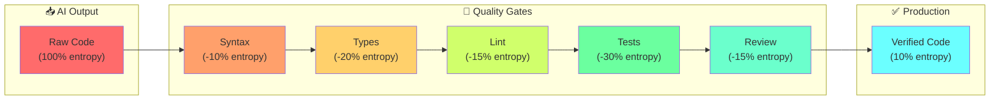
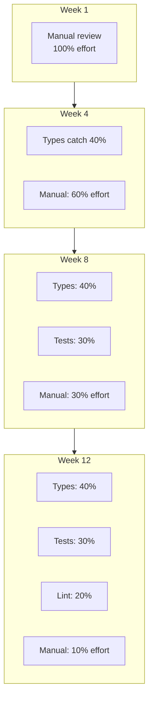

# Chapter 7: Quality Gates That Compound

## Diagram Description
How quality gates filter information and compound reliability over time.

## Mermaid Code

```mermaid
flowchart LR
    subgraph Input["📥 AI Output"]
        A["Raw Code\n(100% entropy)"]
    end

    subgraph Gates["🚦 Quality Gates"]
        G1["Syntax\n(-10% entropy)"]
        G2["Types\n(-20% entropy)"]
        G3["Lint\n(-15% entropy)"]
        G4["Tests\n(-30% entropy)"]
        G5["Review\n(-15% entropy)"]
    end

    subgraph Output["✅ Production"]
        B["Verified Code\n(10% entropy)"]
    end

    A --> G1 --> G2 --> G3 --> G4 --> G5 --> B

    style A fill:#ff6b6b
    style G1 fill:#ffa06b
    style G2 fill:#ffd06b
    style G3 fill:#d0ff6b
    style G4 fill:#6bff9f
    style G5 fill:#6bffcc
    style B fill:#6bffff
```

## Compounding Effect

```mermaid
flowchart TB
    subgraph Week1["Week 1"]
        A1["Manual review\n100% effort"]
    end

    subgraph Week4["Week 4"]
        B1["Types catch 40%"]
        B2["Manual: 60% effort"]
    end

    subgraph Week8["Week 8"]
        C1["Types: 40%"]
        C2["Tests: 30%"]
        C3["Manual: 30% effort"]
    end

    subgraph Week12["Week 12"]
        D1["Types: 40%"]
        D2["Tests: 30%"]
        D3["Lint: 20%"]
        D4["Manual: 10% effort"]
    end

    Week1 --> Week4 --> Week8 --> Week12
```
