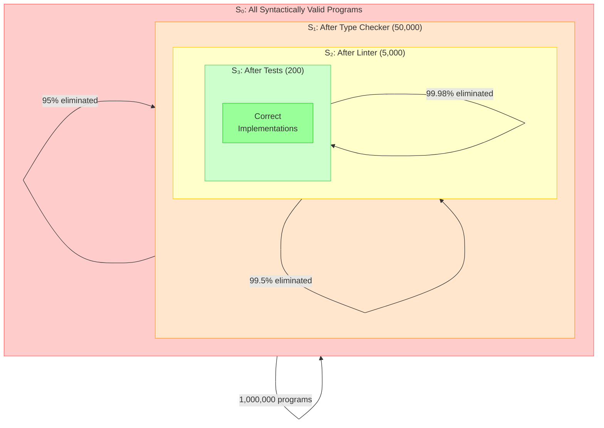
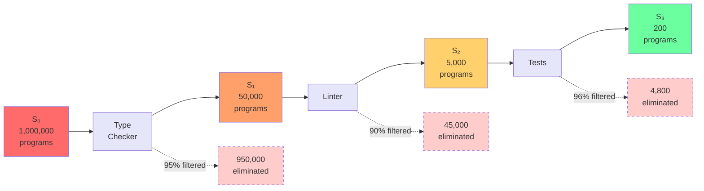
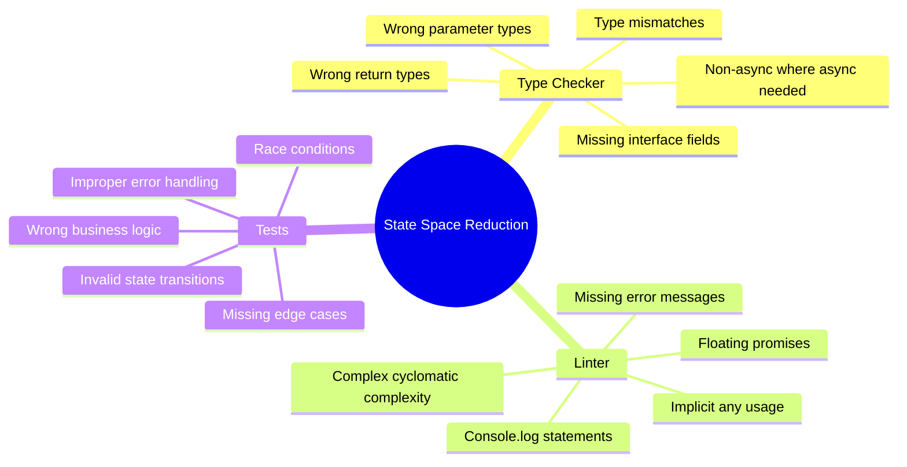

# Diagram: State Space Reduction Through Quality Gates

## Description
Visualizes how quality gates progressively filter the state space of valid programs through set intersection. Each gate eliminates invalid implementations, narrowing from millions of possible programs to a small set of semantically equivalent correct implementations.

## Primary View: Nested Set Reduction



## Alternative View 1: Sequential Filter Pipeline



## Alternative View 2: Set Intersection Formula

```
Mathematical Model:

S₀ = All syntactically valid TypeScript programs
G₁ = Programs passing type checker
G₂ = Programs passing linter
G₃ = Programs passing tests

Sequential intersection:
S₁ = S₀ ∩ G₁   (type-safe programs)
S₂ = S₁ ∩ G₂   (type-safe AND lint-clean)
S₃ = S₂ ∩ G₃   (lint-clean AND passing tests)

Key property - monotonic reduction:
|S₀| > |S₁| > |S₂| > |S₃| > ... > |Sₙ|

Each gate ONLY removes invalid states, never adds new ones.
```

## Alternative View 3: Authentication Function Example

| Gate | Set Size | Eliminated | Cumulative | What Gets Filtered |
|------|----------|------------|------------|-------------------|
| S₀ (baseline) | 1,000,000 | - | 0% | All valid TypeScript functions |
| S₁ (types) | 50,000 | 950,000 | 95.0% | Wrong return types, wrong params, non-async |
| S₂ (linter) | 5,000 | 45,000 | 99.5% | Console.logs, vague errors, complex control flow |
| S₃ (tests) | 200 | 4,800 | 99.98% | Wrong business logic, missing edge cases |

**Final 200 implementations**: Semantically equivalent, all correct. Differ only in minor style choices.

## Alternative View 4: What Each Gate Filters



## Usage Notes

**Where this appears in chapter**: Section "Gates as Information Filters" (lines 9-132)

**Key teaching point**: Quality gates are not pass/fail checkpoints. They are mathematical information filters that reduce the universe of possible programs through set intersection.

**Related concepts**:
- Information theory foundation
- Why gates compound (each works on reduced set)
- LLM probability distributions

## Context from Chapter

From ch07-quality-gates-that-compound.md lines 13-14:
> "Each quality gate performs a set intersection, eliminating invalid states and narrowing the space until only correct implementations remain."

From ch07-quality-gates-that-compound.md lines 32-38:
> "The key property is monotonic reduction. Each intersection reduces the size of the set... Each gate eliminates invalid states without adding new ones."
