# Chapter 8: Circuit Breaker State Machine

## Diagram Description
Visualizes the circuit breaker pattern that prevents cascading failures in AI agent systems. Shows the three states (Closed, Open, Half-Open) and transitions between them based on failure thresholds and recovery timeouts.

## Primary View: State Machine Flow

```mermaid
stateDiagram-v2
    [*] --> Closed

    Closed --> Open: failures > threshold
    Open --> HalfOpen: timeout expires
    HalfOpen --> Closed: test succeeds
    HalfOpen --> Open: test fails

    Closed: Normal Operation
    Closed: ─────────────────
    Closed: Requests flow through
    Closed: Track failure count
    Closed: Reset on success

    Open: Circuit Tripped
    Open: ─────────────────
    Open: Fail immediately
    Open: No requests sent
    Open: Wait for timeout

    HalfOpen: Testing Recovery
    HalfOpen: ─────────────────
    HalfOpen: Allow limited requests
    HalfOpen: Probe service health
    HalfOpen: Decide next state
```

## Alternative View: Flow Diagram

## Reference Table: State Details

| State | Purpose | Behavior | Exit Condition |
|-------|---------|----------|----------------|
| **Closed** | Normal operation | Pass all requests, track failures | Failures reach threshold (e.g., 5 in 60s) |
| **Open** | Protect from cascade | Fail fast, no external calls | Timeout expires (e.g., 30 seconds) |
| **Half-Open** | Test recovery | Allow limited probe requests | Probe succeeds → Closed, fails → Open |

## Triggers and Thresholds

```mermaid
flowchart LR
    subgraph Triggers["Transition Triggers"]
        T1["Failure Count ≥ 5"]
        T2["Timeout = 30 seconds"]
        T3["Probe Success"]
        T4["Probe Failure"]
    end

    subgraph Transitions["State Changes"]
        TR1["Closed → Open"]
        TR2["Open → Half-Open"]
        TR3["Half-Open → Closed"]
        TR4["Half-Open → Open"]
    end

    T1 --> TR1
    T2 --> TR2
    T3 --> TR3
    T4 --> TR4
```

## Configuration Reference

| Parameter | Typical Value | Purpose |
|-----------|---------------|---------|
| `failureThreshold` | 5 | Consecutive failures to trip |
| `resetTimeout` | 30s | Time in Open before testing |
| `halfOpenRequests` | 3 | Probe requests in Half-Open |
| `successThreshold` | 2 | Successes to fully close |
| `monitorWindow` | 60s | Window for counting failures |

## Example: External API Protection

```mermaid
sequenceDiagram
    participant Agent
    participant CB as Circuit Breaker
    participant API as External API

    Note over CB: CLOSED STATE
    Agent->>CB: request 1
    CB->>API: forward
    API-->>CB: ❌ 500 error
    CB-->>Agent: error (failures: 1)

    Agent->>CB: request 2-5
    Note over CB: failures reach 5

    Note over CB: → OPEN STATE
    Agent->>CB: request 6
    CB-->>Agent: fail fast (no API call)

    Note over CB: 30s timeout...

    Note over CB: → HALF-OPEN STATE
    Agent->>CB: request 7 (probe)
    CB->>API: forward (test)
    API-->>CB: ✅ 200 OK
    CB-->>Agent: success

    Note over CB: → CLOSED STATE
    Agent->>CB: request 8+
    CB->>API: forward (normal)
```

## Agent Context: Why This Matters

In AI agent systems, circuit breakers prevent:

1. **Token waste**: Stop sending requests to a dead service
2. **Cost runaway**: Fail fast instead of expensive retries
3. **Cascade failures**: One bad service doesn't crash the system
4. **Context pollution**: Keep error messages from filling context window

| Without Circuit Breaker | With Circuit Breaker |
|------------------------|---------------------|
| 100 failed API calls | 5 failed calls, then fast-fail |
| 100 error messages in context | 5 error messages, then fallback |
| ~50K tokens wasted | ~5K tokens used |
| Agent confused by error spam | Agent uses cached/fallback |

## Usage Notes

**Where this appears:** This diagram supports Chapter 8's error handling discussion, particularly the "Learning Loops: Encoding Prevention" section where circuit breakers would be a quality gate implementation.

**Key concepts illustrated:**
1. State machine behavior for resilience
2. Fail-fast pattern to conserve resources
3. Graceful degradation with Half-Open probing
4. Recovery without manual intervention

**Related chapter content:**
- Five-point error diagnostic framework
- Clean slate recovery patterns
- Quality gate problem category (5% of errors)

## Source

Based on control theory principles from [control-theory.md](../../../kb/03-Math-Reference/control-theory.md) describing circuit breakers as state machines with feedback loops.
