# Chapter 8: Clean Slate Recovery Pattern

## Diagram Description
Sometimes the best path forward is to start fresh. The Clean Slate Recovery pattern preserves learnings from failed attempts while escaping accumulated context pollution. Knowing when and how to apply it prevents wasted effort.

## Primary View: Recovery Decision Flow

```mermaid
flowchart TB
    subgraph Signs["⚠️ Signs You're Stuck"]
        S1["Same error 3+ times"]
        S2["Fixes create new bugs"]
        S3["Context feels corrupted"]
        S4["Going in circles"]
    end

    D{"Should you<br/>clean slate?"}

    Signs --> D

    D -->|No: Progress possible| PERSIST["🔧 Continue Debugging"]
    D -->|Yes: Truly stuck| RECOVER["🧹 Clean Slate Recovery"]

    subgraph Recovery["🔄 Recovery Process"]
        R1["1. Extract constraints<br/>from failure"]
        R2["2. Stash/backup current work"]
        R3["3. Start fresh session"]
        R4["4. Apply constraints<br/>to new attempt"]
        R5["5. Avoid repeated<br/>failed approaches"]

        R1 --> R2 --> R3 --> R4 --> R5
    end

    RECOVER --> Recovery
```

## Alternative View: When to Clean Slate vs Persist

```mermaid
flowchart LR
    subgraph Persist["🔧 Keep Debugging When"]
        P1["Error is isolated"]
        P2["You understand the cause"]
        P3["Fix is incremental"]
        P4["Context is clean"]
    end

    subgraph CleanSlate["🧹 Clean Slate When"]
        C1["Multiple interacting bugs"]
        C2["Lost in complexity"]
        C3["Context pollution"]
        C4["3+ failed attempts"]
    end

    CENTER["Your<br/>Situation"]

    CENTER --> Persist
    CENTER --> CleanSlate
```

## Alternative View: Constraint Extraction

| From Failed Attempt | Extract As Constraint |
|---------------------|----------------------|
| "X approach crashes" | "Avoid approach X" |
| "Library Y has bug" | "Use library Z instead" |
| "API requires auth first" | "Call auth before API" |
| "Order matters: A then B" | "Sequence: A before B" |
| "Edge case: empty input" | "Handle empty input explicitly" |

## Alternative View: Git-Based Recovery

```mermaid
flowchart TB
    subgraph Git["📁 Git Recovery Workflow"]
        G1["git stash push -m 'failed attempt'"]
        G2["git checkout -b fresh-attempt"]
        G3["Work with constraints"]
        G4{"Success?"}
        G5["git stash drop"]
        G6["git stash pop<br/>(compare approaches)"]

        G1 --> G2 --> G3 --> G4
        G4 -->|Yes| G5
        G4 -->|Partially| G6
    end

    subgraph Preserve["🗂️ What to Preserve"]
        PR1["Constraints learned"]
        PR2["Test cases discovered"]
        PR3["Edge cases found"]
        PR4["Architecture insights"]
    end

    G1 --> Preserve
```

## Alternative View: Fresh Eyes Protocol

## Usage

This diagram appears in:
- Section 8.5: Clean Slate Trajectory Recovery
- Helps developers recognize when to stop debugging and start fresh
- Shows how to preserve learnings while escaping context pollution

## Context from Chapter

From chapters/ch08-error-handling-debugging.md:
- "Context pollution is real. Sometimes your conversation history becomes part of the problem."
- "The clean slate isn't giving up. It's strategic reset with accumulated knowledge."
- "Extract constraints before starting fresh. Your failed attempts contain information."
