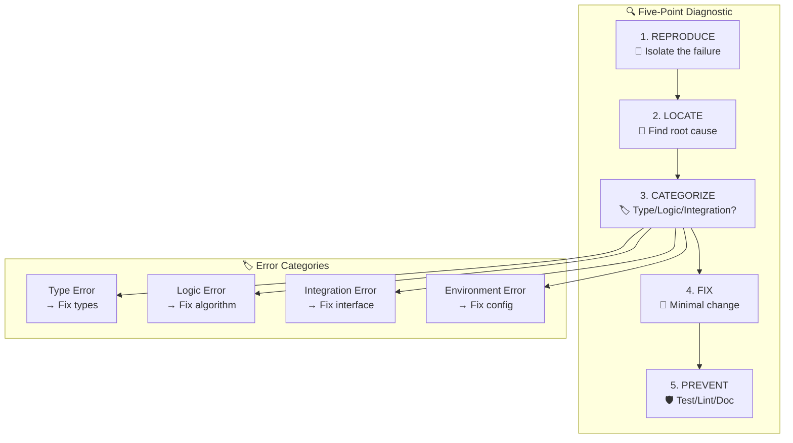
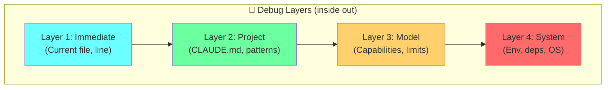

# Chapter 8: Five-Point Error Diagnostic

## Diagram Description
The systematic five-point framework for diagnosing errors.

## Mermaid Code

```mermaid
flowchart TB
    subgraph Framework["🔍 Five-Point Diagnostic"]
        P1["1. REPRODUCE\n🔄 Isolate the failure"]
        P2["2. LOCATE\n📍 Find root cause"]
        P3["3. CATEGORIZE\n🏷️ Type/Logic/Integration?"]
        P4["4. FIX\n🔧 Minimal change"]
        P5["5. PREVENT\n🛡️ Test/Lint/Doc"]

        P1 --> P2 --> P3 --> P4 --> P5
    end

    subgraph Categories["🏷️ Error Categories"]
        C1["Type Error\n→ Fix types"]
        C2["Logic Error\n→ Fix algorithm"]
        C3["Integration Error\n→ Fix interface"]
        C4["Environment Error\n→ Fix config"]
    end

    P3 --> C1
    P3 --> C2
    P3 --> C3
    P3 --> C4
```

## Context Debugging Layers

```mermaid
flowchart TB
    subgraph Layers["🎯 Debug Layers (inside out)"]
        L1["Layer 1: Immediate\n(Current file, line)"]
        L2["Layer 2: Project\n(CLAUDE.md, patterns)"]
        L3["Layer 3: Model\n(Capabilities, limits)"]
        L4["Layer 4: System\n(Env, deps, OS)"]
    end

    L1 --> L2 --> L3 --> L4

    style L1 fill:#6bffff
    style L2 fill:#6bff9f
    style L3 fill:#ffd06b
    style L4 fill:#ff6b6b
```
