# Chapter 8: ERRORS.md Workflow

## Diagram Description
The ERRORS.md pattern transforms errors from one-time annoyances into persistent learning. This diagram shows how documenting errors creates a feedback loop that prevents future occurrences.

## Primary View: Error Learning Cycle

```mermaid
flowchart TB
    subgraph Cycle["♻️ Error Learning Cycle"]
        direction TB
        E["🐛 Error Occurs"]
        D["📝 Document in ERRORS.md"]
        I["📋 Include in Future Context"]
        T["📊 Track Frequency"]
        P["🛡️ Implement Prevention"]

        E --> D
        D --> I
        I --> T
        T --> P
        P -.->|Reduces| E
    end

    subgraph Entry["📄 ERRORS.md Entry Structure"]
        H["## Error: [Name]"]
        F["Frequency: N occurrences"]
        S["Severity: High/Med/Low"]
        SY["Symptom: What you see"]
        B["Bad Pattern: Code"]
        G["Good Fix: Code"]
        PR["Prevention: Rule/Hook"]
    end

    D --> Entry
```

## Alternative View: Monthly Review Process

## Alternative View: Error Categories

| Category | Example | Prevention |
|----------|---------|------------|
| Type Errors | Missing await | `no-floating-promises` lint rule |
| Logic Errors | Off-by-one | Property-based tests |
| Integration Errors | API mismatch | Contract tests |
| Config Errors | Wrong env var | Validation at startup |
| Race Conditions | Async timing | Proper synchronization |

## Alternative View: Error Document Lifecycle

## Usage

This diagram appears in:
- Section 8.3: Error Messages as Training Data (ERRORS.md)
- Explains why documenting errors improves future performance
- Shows the complete workflow from error to prevention

## Context from Chapter

From chapters/ch08-error-handling-debugging.md:
- "Error messages are training data. When you document an error properly, you're creating context that prevents the same mistake."
- "The monthly review is where errors become prevention. You're not just tracking problems. You're building antibodies."
