# Chapter 8: Flaky Test Decision Tree

## Diagram Description
Flaky tests erode confidence in your test suite. This decision tree helps diagnose root causes and apply targeted fixes. A test is flaky when it passes sometimes and fails other times with the same code.

## Primary View: Diagnosis Decision Tree

```mermaid
flowchart TB
    Start["🎲 Test Flaky?<br/>(Passes X%, Fails Y%)"]

    Start -->|Yes| Q1{"Does it fail<br/>only in CI?"}
    Q1 -->|Yes| ENV["🌍 Environment Issue"]
    Q1 -->|No| Q2{"Does it fail<br/>after other tests?"}

    Q2 -->|Yes| ORDER["📑 Test Order Dependency"]
    Q2 -->|No| Q3{"Does it involve<br/>async/timing?"}

    Q3 -->|Yes| RACE["⏱️ Race Condition"]
    Q3 -->|No| Q4{"Does it call<br/>external services?"}

    Q4 -->|Yes| EXT["🌐 External Dependency"]
    Q4 -->|No| Q5{"Does it use<br/>Date.now() or Math.random()?"}

    Q5 -->|Yes| TIME["📆 Time/Random Dependency"]
    Q5 -->|No| OTHER["🔍 Need More Investigation"]

    subgraph Fixes["🔧 Targeted Fixes"]
        F1["ENV: Docker for CI parity"]
        F2["ORDER: Reset state in beforeEach"]
        F3["RACE: Await all promises, use waitFor"]
        F4["EXT: Mock external calls"]
        F5["TIME: Inject clock, seed random"]
    end

    ENV --> F1
    ORDER --> F2
    RACE --> F3
    EXT --> F4
    TIME --> F5
```

## Alternative View: Flaky Test Categories Table

| Root Cause | Symptoms | Detection | Fix |
|------------|----------|-----------|-----|
| Race Condition | Fails randomly, timing-sensitive | Passes locally, fails in slow CI | `await`, `waitFor`, proper sync |
| Test Order | Fails only after specific tests | Run in isolation passes | Reset state in `beforeEach` |
| External Deps | Fails when network slow | Mock responses pass | Mock all external calls |
| Time-Based | Fails near midnight/boundaries | Date mocking reveals it | Inject clock, control time |
| Resource Leaks | Fails after many tests | Increases with test count | Proper cleanup in `afterEach` |
| Random Data | Fails with certain seeds | Same seed reproduces | Seed random generators |

## Alternative View: Detection Script Flow

## Alternative View: CI Integration

```mermaid
flowchart TB
    subgraph CI["🔄 CI Flaky Test Monitoring"]
        T["Run Tests"]
        F{"Any Flaky?"}
        Q["Quarantine Flaky Test"]
        R["Report to Team"]
        FIX["Create Fix Ticket"]

        T --> F
        F -->|Yes| Q --> R --> FIX
        F -->|No| PASS["✅ All Stable"]
    end

    subgraph Quarantine["🏥 Quarantine Strategy"]
        Q1["Move to flaky/ folder"]
        Q2["Run separately (don't block CI)"]
        Q3["Track fix timeline"]
    end

    Q --> Quarantine
```

## Usage

This diagram appears in:
- Section 8.4: Flaky Test Diagnosis
- Helps developers quickly identify why tests are flaky
- Provides targeted fixes rather than generic advice

## Context from Chapter

From chapters/ch08-error-handling-debugging.md:
- "Flaky tests are worse than no tests. They train you to ignore failures."
- "The decision tree approach: instead of guessing, systematically eliminate causes."
- "Run each test 50 times. If it ever fails, it's flaky. Then diagnose why."
