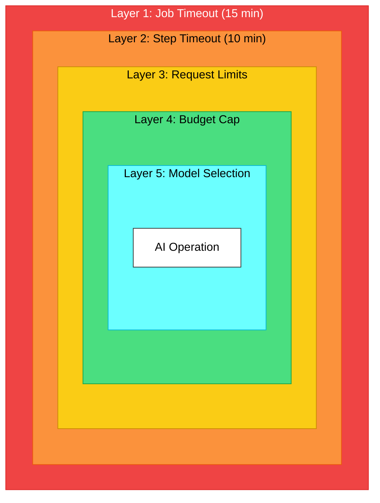
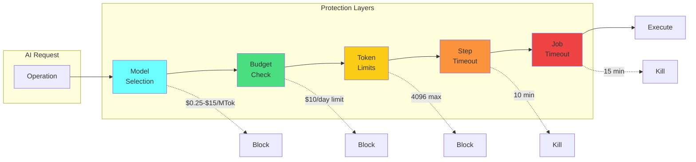
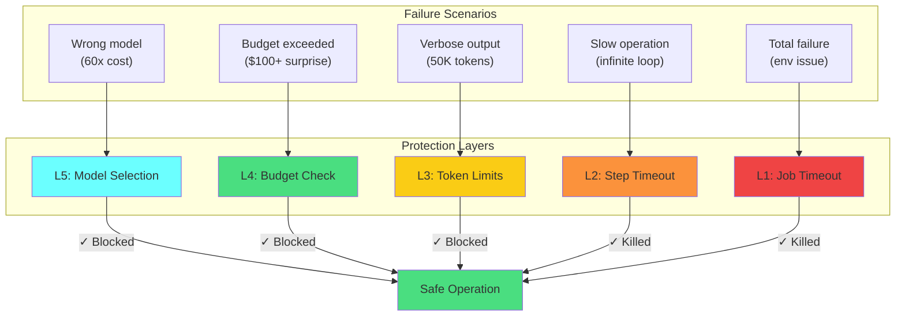

# Chapter 8: Multi-Layer Timeout Protection

## Diagram Description
Visualizes the defense-in-depth approach to cost protection in AI workflows. Shows nested protection layers from innermost (model selection) to outermost (job timeout), where each layer catches failures that slip through inner layers.

## Primary View: Nested Protection Circles



## Alternative View: Protection Layer Stack



## Reference Table: Protection Layer Details

| Layer | Protection Type | Typical Limit | What It Catches | Cost if Layer Fails |
|-------|----------------|---------------|-----------------|---------------------|
| 5 (Inner) | Model Selection | haiku/sonnet/opus | Wrong model for task | 60x cost multiplier |
| 4 | Budget Cap | $10/day, $100/month | Accumulated overrun | Unlimited spend |
| 3 | Token Limits | max_tokens: 4096 | Verbose responses | $75+ per request |
| 2 | Step Timeout | 10 minutes | Slow operations | Time-based runaway |
| 1 (Outer) | Job Timeout | 15 minutes | Everything else | Complete failure |

**Key principle:** Each layer is independent. Even if inner layers fail, outer layers provide backup protection.

## Defense in Depth View: What Each Layer Stops



## Cost Impact Summary

| Scenario | Without Protection | With All 5 Layers |
|----------|-------------------|-------------------|
| Infinite loop | $87+ (manual kill) | $0 (10 min timeout) |
| node_modules scan | $234 (150K files) | $0.75 (50 file limit) |
| Verbose response | $75 (50K tokens) | $0.06 (4K token cap) |
| Wrong model | $15/MTok (opus) | $0.25/MTok (haiku) |
| Monthly runaway | Unlimited | $100 cap |

## Configuration Quick Reference

```text
Layer 1: Job Timeout
  └── timeout-minutes: 15 (GitHub Actions)

Layer 2: Step Timeout
  └── timeout-minutes: 10 (per step)

Layer 3: Request Limits
  ├── max_tokens: 4096
  ├── maxFiles: 50
  ├── maxLinesPerFile: 500
  └── maxTotalTokens: 50000

Layer 4: Budget Cap
  ├── dailyLimit: $10
  ├── monthlyLimit: $100
  └── alertThreshold: 80%

Layer 5: Model Selection
  ├── Simple tasks → haiku ($0.25/MTok)
  ├── Standard tasks → sonnet ($3/MTok)
  └── Complex tasks → opus ($15/MTok)
```

## Usage Notes

**Where this appears:** This diagram supports Chapter 8, Section 8.6 "Circuit Breakers and Reliability Patterns" and the multi-layer timeout protection examples.

**Key concepts illustrated:**
1. Defense in depth: multiple independent protection mechanisms
2. Inner layers optimize, outer layers protect
3. Each layer has specific failure scenarios it addresses
4. Cost compounds without protection, stays predictable with it

**Related chapter content:**
- Circuit breaker patterns (ch08:8.6)
- Cost protection in production (ch15)
- RALPH loop reliability (ch10)

## Source

Based on [ai-cost-protection-timeouts.md](../../../kb/ai-cost-protection-timeouts.md) which documents multi-layer timeout patterns for CI/CD AI workflows.
