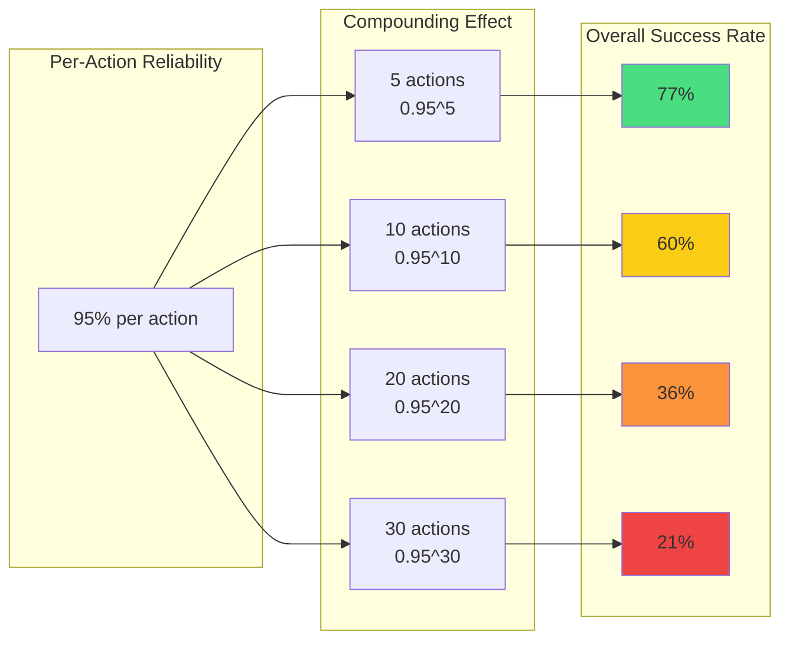
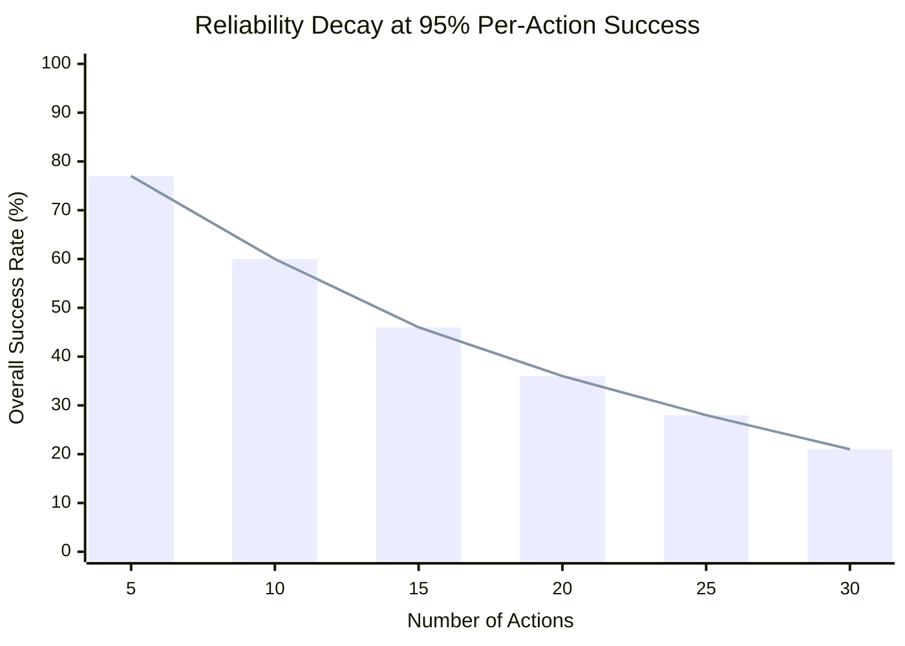
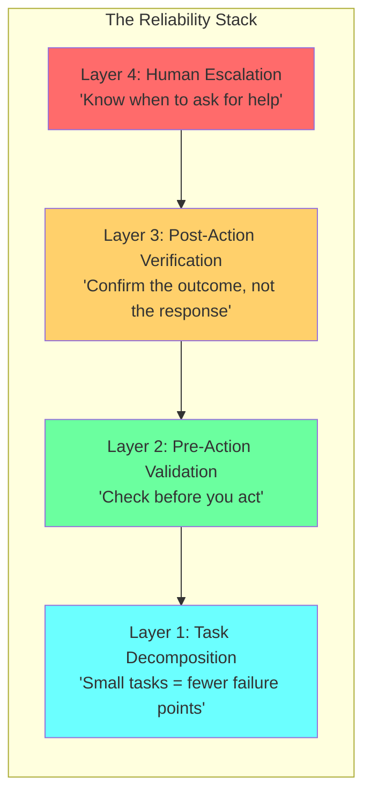

# Chapter 8: Agent Reliability Compounding

## Diagram Description
Visualizes how 95% per-action reliability degrades exponentially in multi-step agent workflows. Shows why demo agents fail in production: 10 actions at 95% reliability yields only 60% overall success.

## Primary View: Reliability Degradation Flow

## Alternative View: Visual Decay Chart

## Reference Table: The Math

| Actions | Per-Action | Calculation | Overall | Status |
|---------|------------|-------------|---------|--------|
| 5 | 95% | 0.95^5 | **77%** | Acceptable |
| 10 | 95% | 0.95^10 | **60%** | Risky |
| 15 | 95% | 0.95^15 | **46%** | Poor |
| 20 | 95% | 0.95^20 | **36%** | Worse than coin flip |
| 30 | 95% | 0.95^30 | **21%** | Failure expected |

**Formula:** `Overall = (Per-Action)^N`

## Solution View: The Reliability Stack

## Impact of Improving Per-Action Reliability

| Current | Target | 10-Action Workflow |
|---------|--------|-------------------|
| 95% | 99% | 60% → **90%** |
| 95% | 99.5% | 60% → **95%** |
| 95% | 99.9% | 60% → **99%** |

**Key insight:** Every 1% improvement in per-action reliability compounds dramatically. Moving from 95% to 99% transforms a 60% success rate into 90%.

## Usage Notes

**Where this appears:** This diagram supports Chapter 8's discussion of why error handling matters in agent systems. It explains the mathematical foundation behind reliability engineering.

**Key concepts illustrated:**
1. Exponential reliability decay in multi-step workflows
2. Why demo agents fail in production (demos use 5-10 actions; production uses 20-30)
3. The four-layer reliability stack as a solution
4. The compounding benefit of small reliability improvements

**Related chapter content:**
- "Compounding improvement" (ch08 conclusion)
- Error categorization and prevention
- Clean slate recovery patterns

## Source

Based on [agent-reliability-chasm.md](../../../kb/agent-reliability-chasm.md) which references Vinci Rufus's research on the reliability chasm in AI agents.
