# Chapter 9: Context Rot Signal-to-Noise Degradation

## Diagram Description
How irrelevant context accumulates over long sessions, degrading signal-to-noise ratio from 90% to 10% over 150 messages.

## Mermaid Code

```mermaid
flowchart TB
    subgraph Degradation["📉 Signal-to-Noise Over Time"]
        M1["Messages 1-20\n🟢 90% signal\nMostly relevant"]
        M2["Messages 21-50\n🟡 60% signal\nMix of current/obsolete"]
        M3["Messages 51-100\n🟠 30% signal\nStale context dominant"]
        M4["Messages 100+\n🔴 10% signal\nBuried in history"]

        M1 --> M2 --> M3 --> M4
    end

    M4 -->|"Triggers"| Symptoms["⚠️ Symptoms:\n• References deleted code\n• Suggests old patterns\n• Confuses current state\n• Hallucinates files"]

    style M1 fill:#6bff9f
    style M2 fill:#ffd06b
    style M3 fill:#ff9f6b
    style M4 fill:#ff6b6b
```



## Alternative View: Before/After Compacting

```mermaid
flowchart LR
    subgraph Before["❌ Before Compacting"]
        B1["150 messages"]
        B2["100K tokens"]
        B3["References deleted code"]
        B4["60% accuracy"]
    end

    subgraph Compact["⚙️ Auto-Compact"]
        C["Summarize work\nPreserve decisions\nRemove noise"]
    end

    subgraph After["✅ After Compacting"]
        A1["10 messages"]
        A2["15K tokens"]
        A3["Clear current state"]
        A4["95% accuracy"]
    end

    Before --> Compact --> After

    style B4 fill:#ff6b6b
    style A4 fill:#6bff9f
```



## Compacting Triggers

```mermaid
flowchart TB
    subgraph Triggers["🔔 When to Compact"]
        T1["After 5-10 tasks"]
        T2["After finishing feature"]
        T3["When switching context"]
        T4["When AI references\ndeleted code"]
        T5["After 100+ messages"]
        T6["Before new major feature"]
    end

    T1 --> Action["🔄 Run compacting prompt"]
    T2 --> Action
    T3 --> Action
    T4 --> Action
    T5 --> Action
    T6 --> Action

    style T4 fill:#ff9f6b
    style T5 fill:#ff9f6b
```



## Numerical Summary

| Metric | Before | After | Improvement |
|--------|--------|-------|-------------|
| Messages | 150 | 10 | 93% reduction |
| Tokens | 100K | 15K | 85% reduction |
| Signal ratio | 10% | 95% | 9.5x improvement |
| Accuracy | 60% | 95% | 35% improvement |

## Usage

This diagram appears after the "Context Rot and Auto-Compacting" section heading (line 260), visualizing the signal-to-noise degradation.

## Context from Chapter

From ch09 lines 275-279:
```
Messages 1-20:   90% signal (mostly relevant)
Messages 21-50:  60% signal (mix of current and obsolete)
Messages 51-100: 30% signal (stale context dominant)
Messages 100+:   10% signal (buried in history)
```
