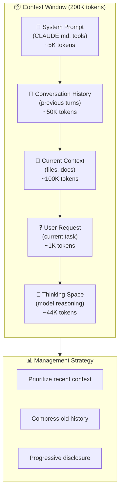
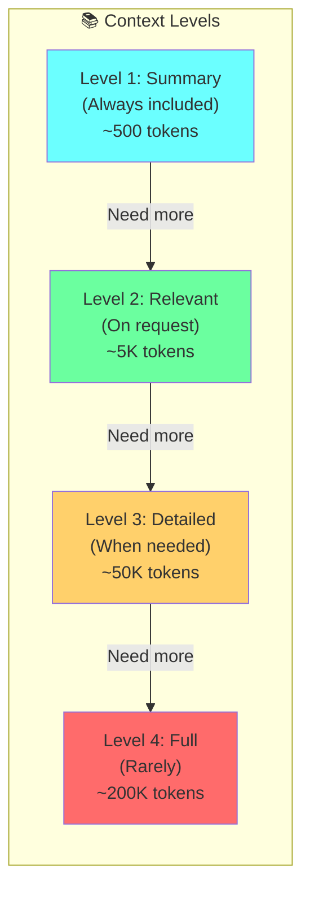

# Chapter 9: Context Window Anatomy

## Diagram Description
Structure of the context window and how to manage it effectively.

## Mermaid Code

```mermaid
flowchart TB
    subgraph Window["📦 Context Window (200K tokens)"]
        direction TB
        S1["🔧 System Prompt\n(CLAUDE.md, tools)\n~5K tokens"]
        S2["💬 Conversation History\n(previous turns)\n~50K tokens"]
        S3["📄 Current Context\n(files, docs)\n~100K tokens"]
        S4["❓ User Request\n(current task)\n~1K tokens"]
        S5["💭 Thinking Space\n(model reasoning)\n~44K tokens"]

        S1 --> S2 --> S3 --> S4 --> S5
    end

    subgraph Strategy["📊 Management Strategy"]
        A["Prioritize recent context"]
        B["Compress old history"]
        C["Progressive disclosure"]
    end

    Window --> Strategy
```

## Progressive Disclosure Pattern

```mermaid
flowchart LR
    subgraph Levels["📚 Context Levels"]
        L1["Level 1: Summary\n(Always included)\n~500 tokens"]
        L2["Level 2: Relevant\n(On request)\n~5K tokens"]
        L3["Level 3: Detailed\n(When needed)\n~50K tokens"]
        L4["Level 4: Full\n(Rarely)\n~200K tokens"]
    end

    L1 -->|"Need more"| L2
    L2 -->|"Need more"| L3
    L3 -->|"Need more"| L4

    style L1 fill:#6bffff
    style L2 fill:#6bff9f
    style L3 fill:#ffd06b
    style L4 fill:#ff6b6b
```
