# Chapter 9: Hierarchical Debugging Protocol

## Diagram Description
Four-layer debugging hierarchy ordered by likelihood of success: Context (60%), Prompting (25%), Model Power (10%), Manual Override (5%).

## Mermaid Code

```mermaid
flowchart TB
    subgraph Hierarchy["🔍 Debug in Order of Likelihood"]
        L1["🎯 Layer 1: CONTEXT\n60% of issues\nAdd files, architecture, errors"]
        L2["📝 Layer 2: PROMPTING\n25% of issues\nAdd examples, constraints"]
        L3["🚀 Layer 3: MODEL POWER\n10% of issues\nEscalate to Opus"]
        L4["👤 Layer 4: MANUAL\n5% of issues\nHuman expertise needed"]

        L1 -->|"Not fixed?"| L2
        L2 -->|"Not fixed?"| L3
        L3 -->|"Not fixed?"| L4
    end

    style L1 fill:#6bff9f,stroke:#333,stroke-width:3px
    style L2 fill:#6bffff,stroke:#333,stroke-width:2px
    style L3 fill:#ffd06b,stroke:#333,stroke-width:1px
    style L4 fill:#ff9f6b,stroke:#333,stroke-width:1px
```



## Alternative View: Pyramid with Success Rates

```mermaid
flowchart TB
    subgraph Pyramid["📊 Issue Distribution"]
        direction TB
        M["👤 Manual (5%)\nDomain expertise"]
        MP["🚀 Model (10%)\nComplex reasoning"]
        P["📝 Prompting (25%)\nClearer instructions"]
        C["🎯 Context (60%)\nMissing information"]

        M --- MP
        MP --- P
        P --- C
    end

    C -.->|"Start here"| StartPoint["✅ 60% resolved instantly"]

    style C fill:#6bff9f
    style P fill:#6bffff
    style MP fill:#ffd06b
    style M fill:#ff9f6b
```



## Time Comparison

```mermaid
flowchart LR
    subgraph Unsystematic["❌ Trial and Error"]
        U1["Try model\n15 min ✗"]
        U2["Rewrite prompt\n10 min ✗"]
        U3["Try tools\n20 min ✗"]
        U4["Add context\n5 min ✓"]
        U1 --> U2 --> U3 --> U4
    end

    subgraph Systematic["✅ Hierarchical"]
        S1["Add context\n5 min ✓"]
    end

    Unsystematic -->|"Total: 50 min"| Result1["Same outcome"]
    Systematic -->|"Total: 5 min"| Result1

    style U4 fill:#6bff9f
    style S1 fill:#6bff9f
```



## Layer Details

| Layer | % of Issues | Problem Signature | Solution |
|-------|-------------|-------------------|----------|
| Context | 60% | Plausible but wrong code | Add files, patterns, errors |
| Prompting | 25% | Has context, wrong output | Add examples, constraints |
| Model | 10% | Needs deeper reasoning | Escalate to Opus |
| Manual | 5% | Domain expertise needed | Human + AI hybrid |

## Usage

This diagram appears after the "Systematic Context Debugging Framework" section heading (line 396), visualizing the four-layer hierarchy.

## Context from Chapter

From ch09 lines 400-414:
```
Layer 1: CONTEXT (60% of issues)
Add missing information, files, examples, architecture
                         ↓
Layer 2: PROMPTING (25% of issues)
Refine instructions, add examples, clarify constraints
                         ↓
Layer 3: MODEL POWER (10% of issues)
Escalate to more powerful model for complex reasoning
                         ↓
Layer 4: MANUAL OVERRIDE (5% of issues)
Recognize when human intuition is needed
```
