# Chapter 9: Entropy Reduction Through Quality Gates

## Diagram Description
Exponential reduction of entropy from syntactically valid to type-safe to tested code. Shows how each quality gate eliminates possible programs.

## Mermaid Code

```mermaid
flowchart TB
    subgraph Reduction["📉 Entropy Reduction Pipeline"]
        S1["All Syntactically Valid\nH = 20 bits\n1,048,576 programs"]
        G1[["🔷 Type Checker"]]
        S2["Type-Safe\nH = 15 bits\n32,768 programs"]
        G2[["🔶 Linter"]]
        S3["Type-Safe + Clean\nH = 12 bits\n4,096 programs"]
        G3[["🟢 Tests"]]
        S4["Correct Programs\nH = 5 bits\n32 programs"]

        S1 --> G1
        G1 -->|"-5 bits"| S2
        S2 --> G2
        G2 -->|"-3 bits"| S3
        S3 --> G3
        G3 -->|"-7 bits"| S4
    end

    style S1 fill:#ff6b6b
    style S2 fill:#ff9f6b
    style S3 fill:#ffd06b
    style S4 fill:#6bff9f
```



## Alternative View: Percentage Filtered

```mermaid
graph LR
    subgraph Filter["🔍 Programs Filtered at Each Stage"]
        F1["Type Checker\nFilters 97%\n(1M → 32K)"]
        F2["Linter\nFilters 88%\n(32K → 4K)"]
        F3["Tests\nFilters 99.2%\n(4K → 32)"]
    end

    F1 --> F2 --> F3

    style F1 fill:#6bffff
    style F2 fill:#ffd06b
    style F3 fill:#6bff9f
```



## Numerical View

| Stage | Entropy (bits) | Valid Programs | % Remaining |
|-------|---------------|----------------|-------------|
| All syntactically valid | 20 | 1,048,576 | 100% |
| After type checker | 15 | 32,768 | 3.1% |
| After linter | 12 | 4,096 | 0.39% |
| After tests | 5 | 32 | 0.003% |

**Total reduction**: 99.997% of programs eliminated

## Why This Matters

```mermaid
flowchart LR
    subgraph ROI["💰 Quality Gate ROI"]
        T["Types\n~3.3 bits/constraint\nHighest ROI"]
        Te["Tests\n~4.3 bits/constraint\nHigh ROI"]
        C["Comments\n~0.15 bits/constraint\nLow ROI"]
    end

    T -->|"11x better"| C
    Te -->|"29x better"| C
```



## Usage

This diagram appears after the entropy formula explanation, visualizing the exponential reduction described in lines 46-64 of ch09.

## Context from Chapter

From ch09 lines 46-64:
```
All syntactically valid programs:  H = 20 bits  (1M+ programs)
                ↓
         [Type Checker]
                ↓
Type-safe programs:                H = 15 bits  (32K programs)
                ↓
           [Linter]
                ↓
Type-safe, clean programs:         H = 12 bits  (4K programs)
                ↓
           [Tests]
                ↓
Type-safe, clean, correct programs: H = 5 bits  (32 programs)
```
