# Chapter 9: Information Theory Pipeline

## Diagram Description
How the four information theory concepts integrate in code generation: channel capacity limits input, entropy measures uncertainty, quality gates filter outputs, final output has low entropy.

## Mermaid Code

## Alternative View: Information Flow

```mermaid
flowchart TB
    subgraph Theory["📚 Information Theory Concepts"]
        C1["1. Channel Capacity\nMax information possible"]
        C2["2. Information Content\nBits per constraint"]
        C3["3. Mutual Information\nContext effectiveness"]
        C4["4. Entropy\nUncertainty in output"]
    end

    subgraph Application["🛠️ Practical Application"]
        A1["Fill context with\nhigh-density content"]
        A2["Types > Tests > Comments\n(11x more bits/token)"]
        A3["Measure output variance\n(1-2 outputs = good)"]
        A4["Quality gates reduce\nentropy exponentially"]
    end

    C1 --> A1
    C2 --> A2
    C3 --> A3
    C4 --> A4
```

## Summary Table

| Concept | Definition | Practical Meaning |
|---------|------------|-------------------|
| Channel Capacity | Max bits through context window | 200K tokens × 4 bits = 800K bits |
| Information Content | Bits per constraint | Types: 3.3 bits, Comments: 0.15 bits |
| Mutual Information | Context → Output correlation | Low variance = effective context |
| Entropy | Uncertainty in output | Quality gates reduce exponentially |

## Usage

This diagram appears after the "Information Theory Foundations" section introduction, showing how the four concepts work together in the code generation pipeline.

## Context from Chapter

From ch09 line 516-519:
> Information theory explains why patterns work:
> - Context fills the channel up to capacity
> - Generation produces output with entropy proportional to constraint quality
> - Quality gates filter by eliminating invalid states
> - Final output has low entropy when constraints compound
