# Chapter 9: Multi-Level Recursive Compacting

## Diagram Description
How compacting works at task, feature, sprint, and version granularity for exponential context reduction.

## Mermaid Code

```mermaid
flowchart TB
    subgraph Levels["📦 Recursive Compacting Levels"]
        L1["Level 1: Tasks\n1-2 sentences per task\n📝 'Fixed auth bug'\n~20 tokens"]
        L2["Level 2: Features\nParagraph per feature\n📄 'Auth system complete'\n~100 tokens"]
        L3["Level 3: Sprints\nDIGEST.md per milestone\n📑 Sprint summary\n~500 tokens"]
        L4["Level 4: Versions\nCHANGELOG.md archive\n📚 Release notes\n~1000 tokens"]

        L1 -->|"Compact"| L2
        L2 -->|"Compact"| L3
        L3 -->|"Archive"| L4
    end

    style L1 fill:#6bffff
    style L2 fill:#6bff9f
    style L3 fill:#ffd06b
    style L4 fill:#ff9f6b
```



## Example Flow

```mermaid
flowchart LR
    subgraph Tasks["📝 10 Task Messages"]
        T1["Fix login bug"]
        T2["Add password reset"]
        T3["Update email template"]
        Tdots["..."]
        T10["Add rate limiting"]
    end

    subgraph Feature["📄 1 Feature Summary"]
        F["Auth system:\n• Fixed login\n• Password reset\n• Rate limiting"]
    end

    subgraph Sprint["📑 Sprint DIGEST"]
        S["Sprint 3:\nAuth complete\nPayments started"]
    end

    Tasks -->|"10:1"| Feature
    Feature -->|"5:1"| Sprint

    style Tasks fill:#6bffff
    style Feature fill:#6bff9f
    style Sprint fill:#ffd06b
```



## Compression Ratios

| Level | Input | Output | Ratio |
|-------|-------|--------|-------|
| Tasks → Feature | 10 messages | 1 paragraph | 10:1 |
| Features → Sprint | 5 features | 1 DIGEST | 5:1 |
| Sprints → Version | 4 sprints | 1 CHANGELOG | 4:1 |
| **Total** | 200 messages | 1 document | 200:1 |

## Compacting Prompt Template

```markdown
Summarize all completed work:

1. What features were implemented?
2. What architectural decisions were made?
3. What's the current state?
4. What's still pending?

Output: Compact summary (max 500 words)
```

## Integration Points

```mermaid
flowchart TB
    subgraph Integration["🔗 Compacting Integration"]
        TD["Todo Lists\n→ Task boundaries"]
        GIT["Git Commits\n→ Commit boundaries"]
        CLAUDE["CLAUDE.md\n→ Package boundaries"]
        PR["Pull Requests\n→ Feature boundaries"]
    end

    TD --> Compact["🔄 Compact at\neach boundary"]
    GIT --> Compact
    CLAUDE --> Compact
    PR --> Compact
```



## Usage

This diagram appears after the "Manual Compacting Strategies" section (line 300), illustrating multi-level compacting.

## Context from Chapter

From ch09 lines 304-308:
> **Recursive compacting** (multi-level):
> - Level 1: 1-2 sentences per completed task
> - Level 2: Paragraph per completed feature
> - Level 3: DIGEST.md per milestone
> - Level 4: Archive to CHANGELOG.md
