# Chapter 9: Run Silent Backpressure Pattern

## Diagram Description
Token savings from the run_silent() pattern: swallow output on success, dump on failure. Keeps context in optimal performance zone.

## Mermaid Code

```mermaid
flowchart TB
    subgraph Pattern["🔇 run_silent() Pattern"]
        Test["Run Test"]
        Check{{"Success?"}}
        Pass["✓ Print indicator\n(10 tokens)"]
        Fail["✗ Dump full output\n(500+ tokens)"]

        Test --> Check
        Check -->|"Yes"| Pass
        Check -->|"No"| Fail
    end

    style Pass fill:#6bff9f
    style Fail fill:#ff9f6b
```



## Before/After Comparison

```mermaid
flowchart LR
    subgraph Before["❌ Without Backpressure"]
        B1["Auth tests: 50 lines"]
        B2["Utils tests: 80 lines"]
        B3["API tests: 70 lines"]
        B4["Total: 200 lines\n~500 tokens"]
    end

    subgraph After["✅ With Backpressure"]
        A1["✓ Auth tests"]
        A2["✓ Utils tests"]
        A3["✓ API tests"]
        A4["Total: 3 lines\n~15 tokens"]
    end

    Before -->|"97% reduction"| After

    style B4 fill:#ff9f6b
    style A4 fill:#6bff9f
```



## Output Examples

### Success Output
```
✓ Auth tests
✓ Utils tests
✓ API tests
```

### Failure Output
```
✓ Auth tests
✓ Utils tests
✗ API tests

FAIL src/api/users.test.ts
● should validate email format
  Expected: true
  Received: false
```

## Performance Zone

```mermaid
flowchart LR
    subgraph Zones["🎯 Context Performance Zones"]
        Optimal["Optimal Zone\n< 75K tokens\n✅ Full capability"]
        Degraded["Degraded Zone\n75K-150K tokens\n⚠️ Misses errors"]
        Dumb["Dumb Zone\n> 150K tokens\n❌ Ignores instructions"]
    end

    Optimal --> Degraded --> Dumb

    style Optimal fill:#6bff9f
    style Degraded fill:#ffd06b
    style Dumb fill:#ff6b6b
```



## Key Principle

| Approach | Token Cost | Reliability |
|----------|------------|-------------|
| Full output always | 500+ tokens/run | Non-deterministic parsing |
| run_silent() | 10-15 tokens/run | Deterministic indicators |

**Savings**: 97% token reduction on passing tests

## Usage

This diagram appears after the "Context-Efficient Backpressure" section (line 330), illustrating the run_silent() pattern.

## Context from Chapter

From ch09 lines 330-334:
> When tests pass, developers waste context conveying results that need fewer than 10 tokens to communicate. Claude models perform optimally within approximately 75K tokens. Beyond this, agents miss obvious errors and ignore instructions.
