# Chapter 10: Clean Slate Recovery - The Decision Point

## Diagram Description
When an agent gets stuck in a broken trajectory (repeated failed attempts, circular reasoning, declining suggestion quality), continuing is counterproductive. The Clean Slate Recovery pattern recognizes the inflection point (typically at attempt 3) where starting fresh with explicit constraints becomes more economical than persisting.

## Primary Mermaid Diagram


## Alternative View 1: Warning Signs Checklist

```mermaid
flowchart TB
    subgraph Signs["⚠️ Warning Signs"]
        S1["Same approach variations\n'try X... try X with Y...'"]
        S2["Circular reasoning\n'maybe we should go back to...'"]
        S3["Declining quality\n'later suggestions worse'"]
        S4["The 'stuck' feeling\n'nothing is working'"]
    end

    Signs --> Threshold["🛑 3-Attempt Threshold"]
    Threshold --> Action["🔄 Trigger Clean Slate"]
```



## Alternative View 2: The 3-Attempt Threshold

| Attempt | Purpose | Action if Fails |
|---------|---------|-----------------|
| **1** | Initial approach | Refine |
| **2** | Refinement/variation | Try alternative |
| **3** | Alternative approach | **STOP - Clean Slate** |
| 4+ | Diminishing returns | Wasted tokens |

## Alternative View 3: Clean Slate Process


## Alternative View 4: Example Recovery - JWT Auth Problem

**Old Trajectory (stuck):**
```
Attempt 1: JWT refresh tokens
  → Failed: API doesn't support refresh endpoint

Attempt 2: Store refresh token in localStorage
  → Failed: Still no endpoint to use it

Attempt 3: Adjust token validation
  → Failed: API design issue, not validation

Decision: TRIGGER CLEAN SLATE
```

**New Session (clean slate with constraints):**
```markdown
Task: Implement authentication that keeps users logged in.

Context: Previous approach tried JWT refresh tokens but failed
because our API doesn't expose refresh endpoints and we cannot
modify the backend.

Constraints:
- Must use session-based auth (API provides session cookies)
- Cannot modify backend API (external service)
- Must handle 401 responses by redirecting to login
- Should persist session across page refreshes

Result: Agent proposes axios interceptor + session cookies
→ Success on first attempt!
```

## Alternative View 5: Economic Analysis


## Usage
- **Chapter location**: Section 4.8 "Clean Slate Recovery Patterns"
- **Key insight**: Fresh context is cheaper than broken context
- **Critical point**: Recognize the inflection point at attempt 3

## Context from Chapter
> "The intuition to 'push through' is wrong when applied to LLM conversations. Each failed attempt pollutes the context window, making subsequent attempts more likely to fail. The 3-attempt threshold is not arbitrary - it's the point where the cost of continuing exceeds the cost of starting fresh. Document the root cause (not symptoms), frame with explicit constraints, and watch the fresh context solve in 1-2 attempts what the broken trajectory couldn't solve in 6+."

## Framing Template for Clean Slate

```markdown
Task: [What you're trying to accomplish]

Context: Previous approaches tried [X, Y, Z] but failed because
[root cause analysis].

Constraints:
- [Hard constraint 1]
- [Hard constraint 2]
- [What cannot change]

Boundaries:
- [What the solution must do]
- [What the solution must not do]

Propose approach before implementing.
```
