# Chapter 10: Four-Phase Cycle with Time Allocation

## Diagram Description
The RALPH Loop operates in four distinct phases with deliberate time allocation. Planning and Review dominate (40% each) while actual Work is compressed (20%). The Compound phase, though time-efficient, is foundational for accumulating value across iterations.

## Primary Mermaid Diagram

## Alternative View 1: Phase Flow with Activities

## Alternative View 2: Time Investment Table

| Phase | Allocation | Focus | Key Activities |
|-------|------------|-------|----------------|
| **Plan** | 40% | Understanding | Research, read context, analyze patterns, synthesize approach |
| **Work** | 20% | Execution | Write code, write tests, run checks, commit |
| **Review** | 40% | Verification | Examine outputs, verify criteria, extract lessons |
| **Compound** | Critical | Value Capture | Update AGENTS.md, add prevention, document learnings |

## Alternative View 3: Why This Distribution Matters

```mermaid
flowchart TB
    subgraph Traditional["❌ Traditional Approach"]
        T1["10% Planning"]
        T2["80% Coding"]
        T3["10% Review"]
        T1 --> T2 --> T3
    end

    subgraph RALPH["✓ RALPH Approach"]
        R1["40% Planning"]
        R2["20% Coding"]
        R3["40% Review"]
        R1 --> R2 --> R3
    end

    Traditional -->|"Results in"| Bad["Rework loops\nContext rot\nRepeated mistakes"]
    RALPH -->|"Results in"| Good["First-time success\nFresh context\nCompounding knowledge"]
```

## Usage
- **Chapter location**: Section 4.2 "The Four-Phase Cycle"
- **Key insight**: Heavy upfront planning prevents rework; heavy review captures value
- **Critical point**: The Compound phase is time-efficient but foundational

## Context from Chapter
> "Phase 1 (Plan) commands 40% because understanding context prevents costly rework. Phase 2 (Work) is compressed to 20% because well-planned work executes quickly. Phase 3 (Review) takes 40% to extract maximum learning value. The Compound phase, though time-efficient, is where individual iterations become curriculum for future work."

## The Four Dimensions of Compounding

