# Chapter 10: Gas Town - Multi-Agent Coordination

## Diagram Description
The "Gas Town" pattern extends the RALPH Loop from sequential single-agent iterations to parallel multi-agent development. Named for the coordination required when multiple agents work simultaneously, this pattern positions the human engineer as architect and strategist while agents execute granularly-decomposed tasks. Coordination happens through shared memory (AGENTS.md, Git, TASKS.md) rather than direct communication.

## Primary Mermaid Diagram

```mermaid
flowchart TB
    subgraph Human["👤 Human Engineer"]
        H1["Architecture decisions"]
        H2["Strategy & planning"]
        H3["Task decomposition"]
        H4["Quality review"]
    end

    Human --> Coord["📋 Coordination Layer"]

    subgraph Agents["🤖 Parallel Agents"]
        A1["Agent 1\nTask A"]
        A2["Agent 2\nTask B"]
        A3["Agent 3\nTask C"]
    end

    Coord --> A1
    Coord --> A2
    Coord --> A3

    subgraph Shared["💾 Shared Memory"]
        S1["Git Repository"]
        S2["AGENTS.md"]
        S3["TASKS.md"]
    end

    A1 <--> Shared
    A2 <--> Shared
    A3 <--> Shared

    style Shared fill:#e7f5ff,stroke:#1c7ed6
```



## Alternative View 1: RALPH Loop Evolution


## Alternative View 2: Coordination Mechanisms

| Mechanism | Purpose | How It Works |
|-----------|---------|--------------|
| **Shared AGENTS.md** | Prevent duplicate learning | All agents read/write same file |
| **Git + Worktrees** | Parallel code changes | Each agent has isolated branch |
| **TASKS.md Dependencies** | Sequence coordination | Blocked tasks wait for completion |
| **Merge Conflicts** | Real coordination blocker | Forces human resolution |
| **Status Updates** | Progress visibility | Agents update task status |

## Alternative View 3: Dependency Coordination Example


## Alternative View 4: Parallel Safe Work

```mermaid
flowchart TB
    subgraph Safe["✅ Safe for Parallel"]
        S1["Feature A\n(auth module)"]
        S2["Feature B\n(dashboard)"]
        S3["Feature C\n(settings)"]
    end

    subgraph Unsafe["⚠️ Requires Coordination"]
        U1["Shared types"]
        U2["Database schema"]
        U3["Core utilities"]
    end

    subgraph Human["👤 Human Decides"]
        D1["Decompose tasks"]
        D2["Assign dependencies"]
        D3["Monitor conflicts"]
    end

    Human --> Safe
    Human --> Unsafe
```



## Usage
- **Chapter location**: Section 4.6 "Multi-Agent Coordination"
- **Key insight**: Human shifts from coding to orchestrating agents
- **Critical point**: Coordination through files, not conversation

## Context from Chapter
> "In the Gas Town pattern, the human engineer's role fundamentally shifts. Instead of writing code directly, you become the architect who decomposes work into agent-sized tasks, the strategist who sequences dependencies, and the quality gate who reviews merged work. Multiple agents work simultaneously on independent tasks, synchronizing through shared memory rather than direct communication."

## When to Use Multi-Agent

| Scenario | Single Agent | Multi-Agent |
|----------|--------------|-------------|
| Small feature | Preferred | Overkill |
| Independent features | Possible | Ideal |
| Dependent features | Required | Needs coordination |
| Complex refactor | Works | Risky |
| Large sprint | Slow | Fast |
| Overnight shift | Works | Multiplies output |

## Git Worktree Setup

```bash
# Create worktrees for parallel agents
git worktree add ../agent-1-work feature/task-a
git worktree add ../agent-2-work feature/task-b
git worktree add ../agent-3-work feature/task-c

# Each agent runs in its own directory
# All share the same .git but isolated working trees
```
