# Chapter 10: Memory Architecture - Three Layers

## Diagram Description
The RALPH Loop maintains memory across iterations not through conversation history, but through three distinct persistence layers: AGENTS.md (patterns and conventions), Git History (code and commit messages), and Task Files (progress and blockers). Each layer serves a specific purpose and together they replace the need for continuous conversation context.

## Primary Mermaid Diagram

```mermaid
flowchart TB
    subgraph Agent["🤖 Fresh Agent Instance #N"]
        A1["No prior conversation history"]
        A2["Clean context window"]
        A3["Full reasoning capacity"]
    end

    subgraph Memory["💾 Three-Layer Memory Architecture"]
        subgraph L1["Layer 1: AGENTS.md"]
            L1a["Patterns"]
            L1b["Conventions"]
            L1c["Gotchas"]
            L1d["Best practices"]
        end

        subgraph L2["Layer 2: Git History"]
            L2a["Code changes"]
            L2b["Commit messages"]
            L2c["Previous failures"]
            L2d["Diff patterns"]
        end

        subgraph L3["Layer 3: Task Files"]
            L3a["TASKS.md"]
            L3b["Progress status"]
            L3c["Blockers"]
            L3d["Dependencies"]
        end
    end

    Agent -->|"Reads"| L1
    Agent -->|"Reads"| L2
    Agent -->|"Reads & Updates"| L3
    Agent -->|"Updates"| L1

    L1 -->|"Inherited knowledge"| NextAgent
    L2 -->|"Pattern examples"| NextAgent
    L3 -->|"Next task"| NextAgent

    subgraph NextAgent["🤖 Fresh Agent Instance #N+1"]
        N1["Inherits all learnings"]
        N2["Clean context"]
        N3["Ready to compound"]
    end
```

## Alternative View 1: Layer Purpose Matrix

| Layer | What It Stores | When Updated | How Agent Uses It |
|-------|---------------|--------------|-------------------|
| **AGENTS.md** | Patterns, conventions, gotchas, decisions | End of each iteration | Read at start for inherited wisdom |
| **Git History** | Code changes, commit messages, diffs | Every commit | Query with `git log --grep` for patterns |
| **Task Files** | Task status, blockers, dependencies | During iteration | Track progress, select next task |

## Alternative View 2: The Flywheel Effect

## Alternative View 3: Example AGENTS.md Sections

## Alternative View 4: Information Flow Per Iteration

## Usage
- **Chapter location**: Section 4.3 "Memory Architecture"
- **Key insight**: Files replace conversation history as persistence mechanism
- **Critical point**: Each layer serves a specific purpose, together they compound

## Context from Chapter
> "The three-layer architecture transforms ephemeral conversation knowledge into durable institutional knowledge. Git captures the 'what', TASKS.md captures the 'what next', and AGENTS.md captures the 'how and why'. Together, they enable fresh agents to operate as if they have the full context of every previous iteration."

## Layer Comparison Table

| Aspect | AGENTS.md | Git History | Task Files |
|--------|-----------|-------------|------------|
| **Purpose** | Inherited wisdom | Code evolution | Progress tracking |
| **Durability** | Long-term | Permanent | Short-term |
| **Update frequency** | End of iteration | Every commit | During iteration |
| **Query method** | Direct read | git log/grep | Direct read |
| **Growth pattern** | Organic sections | Linear commits | Tasks complete |
| **Example** | "Migrations must be idempotent" | commit abc123 | "- [x] Add user auth" |
