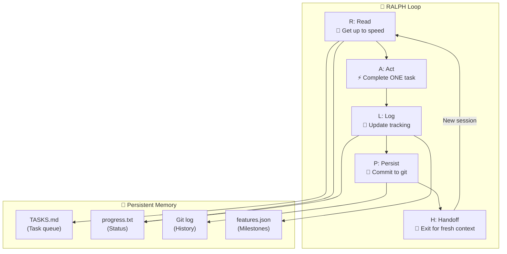

# Chapter 10: The RALPH Loop

## Diagram Description
The RALPH (Recursive Agent Loop with Progress Handoffs) pattern for long-running development.

## Mermaid Code

```mermaid
flowchart TB
    subgraph RALPH["🔄 RALPH Loop"]
        direction TB
        R["R: Read\n📖 Get up to speed"]
        A["A: Act\n⚡ Complete ONE task"]
        L["L: Log\n📝 Update tracking"]
        P["P: Persist\n💾 Commit to git"]
        H["H: Handoff\n🔄 Exit for fresh context"]

        R --> A --> L --> P --> H
        H -->|"New session"| R
    end

    subgraph Memory["💾 Persistent Memory"]
        M1["TASKS.md\n(Task queue)"]
        M2["progress.txt\n(Status)"]
        M3["Git log\n(History)"]
        M4["features.json\n(Milestones)"]
    end

    R --> M1
    R --> M2
    L --> M2
    P --> M3
    L --> M4
```

## 24/7 Development Strategy

```mermaid
gantt
    title 24-Hour RALPH Cycle
    dateFormat HH:mm

    section Human
    Active Development    :a1, 09:00, 8h
    Review & Planning     :a2, 17:00, 1h

    section AI Agent
    Overnight Tasks       :b1, 00:00, 9h
    Parallel Tasks        :b2, 09:00, 8h
    Overnight Tasks       :b3, 18:00, 6h
```
