# Chapter 11: Sub-Agent Architecture Diagrams

## Diagram 1: Team Structure and Handoffs

**Description**: Orchestrator at center, four specialists with handoff arrows and information flow.

```mermaid
flowchart TB
    subgraph Orchestrator["🎯 Orchestrator Agent"]
        O["Receives task<br/>Distributes work<br/>Aggregates results"]
    end

    subgraph Specialists["Specialized Sub-Agents"]
        BE["🔧 Backend Engineer<br/>API endpoints<br/>Business logic<br/>DB schemas"]
        FE["🎨 Frontend Engineer<br/>UI components<br/>State management<br/>Design system"]
        QA["🧪 QA Engineer<br/>Happy paths<br/>Edge cases<br/>Integration tests"]
        CR["🔍 Code Reviewer<br/>Security audit<br/>Pattern compliance<br/>READ-ONLY"]
    end

    O -->|"Task: Implement feature"| BE
    O -->|"Task: Build UI"| FE
    BE -->|"Endpoint spec + schema"| FE
    BE -->|"API to test"| QA
    FE -->|"Component to test"| QA
    QA -->|"Tests to review"| CR
    BE -->|"Code to review"| CR
    FE -->|"Code to review"| CR
    CR -->|"Findings + approval"| O

    style CR fill:#e1f5fe,stroke:#01579b
    style BE fill:#fff3e0,stroke:#e65100
    style FE fill:#f3e5f5,stroke:#7b1fa2
    style QA fill:#e8f5e9,stroke:#2e7d32
```

### Alternative: Simple Flow View

```mermaid
flowchart LR
    Task["📋 Task"]
    BE["Backend"]
    FE["Frontend"]
    QA["QA"]
    CR["Review"]
    Done["✅ Done"]

    Task --> BE --> FE --> QA --> CR --> Done

    subgraph Parallel["Can run parallel"]
        BE
        FE
    end
```

---

## Diagram 2: Three-Layer Context Hierarchy

**Description**: Pyramid showing context inheritance from root to agent to package level.

### Table View

| Layer | Content | Example |
|-------|---------|---------|
| **Root CLAUDE.md** | Shared patterns for all agents | Error handling: Use Result pattern |
| **Agent Flows** | Role-specific workflows | Backend: understand -> design -> implement |
| **Package Context** | Local conventions | API: Use Zod for validation schemas |

---

## Diagram 3: Accuracy vs Latency Trade-off

**Description**: Quadrant chart showing when to use different approaches.

### Decision Framework

---

## Diagram 4: Actor-Critic Loop

**Description**: Circular flow showing iterative refinement until approval.

```mermaid
flowchart TB
    subgraph Actor["🎭 Actor (Code Generator)"]
        A["Generates code<br/>Optimistic approach<br/>Focus on functionality"]
    end

    subgraph Critic["🔍 Critic (Code Reviewer)"]
        C["Reviews 8 dimensions<br/>Paranoid approach<br/>Assumes vulnerabilities"]
    end

    A -->|"Initial code"| C
    C -->|"Issues found?"| Decision{Issues > 0?}
    Decision -->|"Yes: Issues found"| Feedback["Critique Report<br/>- Security: 3 issues<br/>- Architecture: 1 issue<br/>- Performance: 2 issues"]
    Feedback -->|"Fix these"| A
    Decision -->|"No: Approved"| Done["✅ Production Ready"]

    subgraph Rounds["Rounds Example"]
        R1["Round 1: 7 issues"]
        R2["Round 2: 4 issues"]
        R3["Round 3: 2 issues"]
        R4["Round 4: 0 issues"]
        R1 --> R2 --> R3 --> R4
    end
```

### Eight Critique Dimensions

| Dimension | Focus Areas |
|-----------|-------------|
| 1. Security | SQL injection, XSS, CSRF, secrets, rate limiting |
| 2. Architecture | Layer separation, dependency direction, SRP |
| 3. Performance | N+1 queries, indexes, caching, pagination |
| 4. Testing | Coverage, edge cases, error scenarios |
| 5. Error Handling | No swallowed exceptions, context, recovery |
| 6. Documentation | JSDoc, README, API docs |
| 7. Accessibility | ARIA, keyboard nav, screen readers |
| 8. Code Quality | DRY, naming, no magic numbers |

---

## Diagram 5: Swarm Patterns - Many Perspectives

**Description**: Central code surrounded by multiple agent perspectives.

```mermaid
flowchart TB
    Code["📄 Code Under Review"]

    subgraph Swarm["🐝 Agent Swarm (10 Perspectives)"]
        P1["🔒 Security"]
        P2["⚡ Performance"]
        P3["📝 Code Quality"]
        P4["🧪 Test Coverage"]
        P5["🔀 Edge Cases"]
        P6["⚠️ Error Handling"]
        P7["🔗 Integration"]
        P8["📊 Types"]
        P9["💾 Memory"]
        P10["🔄 Race Conditions"]
    end

    Code --> P1 & P2 & P3 & P4 & P5
    Code --> P6 & P7 & P8 & P9 & P10

    P1 & P2 & P3 & P4 & P5 --> Aggregate
    P6 & P7 & P8 & P9 & P10 --> Aggregate

    subgraph Output["Aggregated Results"]
        Aggregate["De-duplicate<br/>Rank by severity<br/>Confidence score"]
        Report["📋 Final Report<br/>15 issues found<br/>5 high confidence"]
    end

    Aggregate --> Report
```

### Swarm Patterns

| Pattern | Description | Use Case |
|---------|-------------|----------|
| Many Perspectives | 10 agents, different focus | Pre-deploy review |
| Same Perspective 4x | 1 focus, 4 runs | Catch probabilistic misses |
| Many-Many | 10 perspectives x 4 runs | Security audit |

---

## Diagram 6: Sequential vs Parallel Orchestration

**Description**: Timeline comparison showing time savings.

### Time Comparison Table

| Approach | Backend | Frontend | QA | Review | **Total** |
|----------|---------|----------|-----|--------|-----------|
| Sequential | 8m | 7m | 6m | 5m | **26m** |
| Parallel (BE+FE) | 8m | 7m (parallel) | 6m | 5m | **19m** |
| **Savings** | | | | | **27%** |

---

## Diagram 7: Parallel Agents for Monorepo

**Description**: Orchestrator coordinating parallel updates across packages.

```mermaid
flowchart TB
    subgraph Orchestrator["🎯 Orchestrator"]
        Task["Task: Update logger v2 → v3"]
    end

    subgraph Packages["20 Packages (Parallel)"]
        direction LR
        P1["📦 pkg-1<br/>5K tokens"]
        P2["📦 pkg-2<br/>5K tokens"]
        P3["📦 pkg-3<br/>5K tokens"]
        Dots["..."]
        P20["📦 pkg-20<br/>5K tokens"]
    end

    Task --> P1 & P2 & P3 & Dots & P20

    P1 -->|"8m"| Done
    P2 -->|"7m"| Done
    P3 -->|"9m"| Done
    Dots -->|"..."| Done
    P20 -->|"6m"| Done

    Done["✅ All Complete<br/>Max time: 9m"]

    style Done fill:#c8e6c9,stroke:#2e7d32
```

### Sequential vs Parallel Comparison

| Metric | Sequential | Parallel | Improvement |
|--------|------------|----------|-------------|
| Time | 160 min | 9 min | **17x faster** |
| Context per agent | 80K tokens | 5K tokens | **16x cleaner** |
| Consistency | Drifts over time | Identical | **100%** |
| Error isolation | Cascades | Contained | **Better** |

---

## Usage Notes

These diagrams appear in Chapter 11 to illustrate:
- **Diagram 1**: Section "The Sub-Agent Team Structure" (lines 31-43)
- **Diagram 2**: Section "The Three-Layer Context Hierarchy" (lines 46-134)
- **Diagram 3**: Section "Accuracy vs. Latency Trade-Offs" (lines 428-461)
- **Diagram 4**: Section "Actor-Critic Adversarial Coding" (lines 501-582)
- **Diagram 5**: Section "Agent Swarm Patterns" (lines 463-499)
- **Diagram 6**: Section "Sequential vs Parallel" (implied in team structure discussion)
- **Diagram 7**: Section "Parallel Agents for Monorepos" (lines 584-633)
