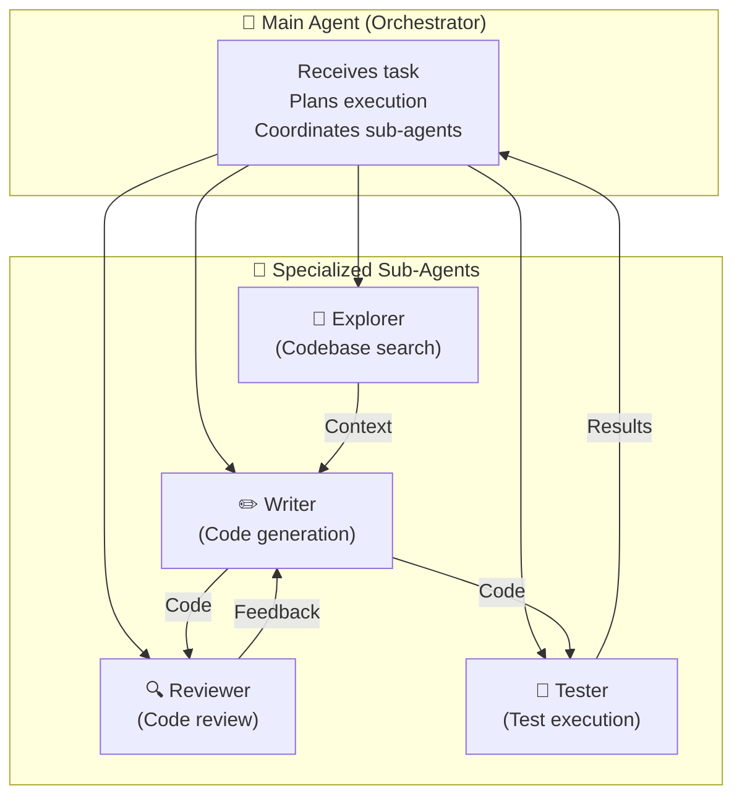
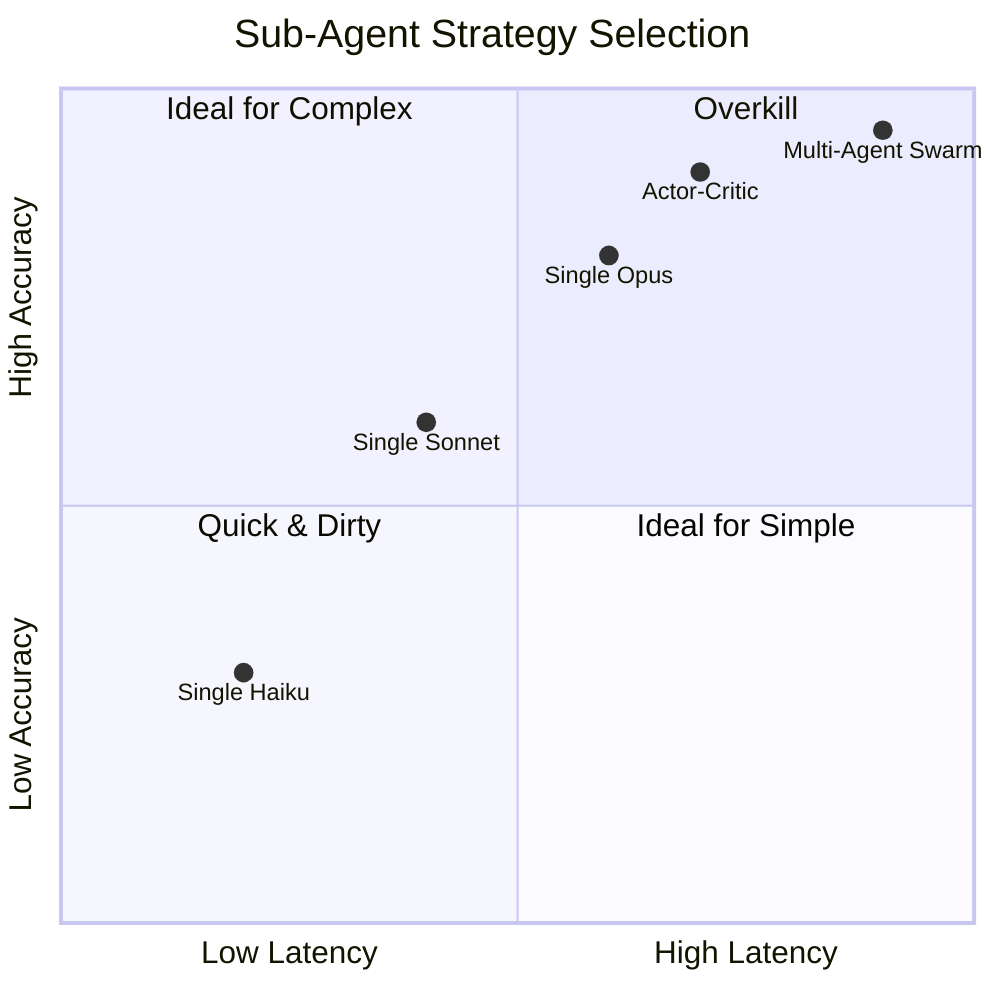

# Chapter 11: Sub-Agent Architecture

## Diagram Description
Architecture patterns for coordinating multiple specialized agents.

## Mermaid Code

```mermaid
flowchart TB
    subgraph Orchestrator["🎯 Main Agent (Orchestrator)"]
        O["Receives task\nPlans execution\nCoordinates sub-agents"]
    end

    subgraph SubAgents["🤖 Specialized Sub-Agents"]
        S1["📖 Explorer\n(Codebase search)"]
        S2["✏️ Writer\n(Code generation)"]
        S3["🔍 Reviewer\n(Code review)"]
        S4["🧪 Tester\n(Test execution)"]
    end

    O --> S1
    O --> S2
    O --> S3
    O --> S4

    S1 -->|"Context"| S2
    S2 -->|"Code"| S3
    S3 -->|"Feedback"| S2
    S2 -->|"Code"| S4
    S4 -->|"Results"| O
```

## Accuracy vs Latency Tradeoff

```mermaid
quadrantChart
    title Sub-Agent Strategy Selection
    x-axis Low Latency --> High Latency
    y-axis Low Accuracy --> High Accuracy

    quadrant-1 Overkill
    quadrant-2 Ideal for Complex
    quadrant-3 Quick & Dirty
    quadrant-4 Ideal for Simple

    "Single Haiku": [0.2, 0.3]
    "Single Sonnet": [0.4, 0.6]
    "Single Opus": [0.6, 0.8]
    "Multi-Agent Swarm": [0.9, 0.95]
    "Actor-Critic": [0.7, 0.9]
```
