# Chapter 12: Development Workflows - Diagrams

> Comprehensive diagrams for development workflow patterns in AI-assisted development.

---

## 1. Plan Mode Decision Tree

### Diagram Description
When to use plan mode vs immediate implementation, based on task complexity thresholds.

### Primary View: Decision Flowchart

```mermaid
flowchart TB
    Start["New Task Arrives"]

    Q1{"Task touches\n>3 files?"}
    Q2{"Unknown\narchitecture?"}
    Q3{"Multiple valid\napproaches?"}
    Q4{"User explicitly\nrequests plan?"}

    PlanMode["🎯 Use Plan Mode"]
    Immediate["⚡ Immediate Implementation"]

    Start --> Q1
    Q1 -->|"Yes"| PlanMode
    Q1 -->|"No"| Q2
    Q2 -->|"Yes"| PlanMode
    Q2 -->|"No"| Q3
    Q3 -->|"Yes"| PlanMode
    Q3 -->|"No"| Q4
    Q4 -->|"Yes"| PlanMode
    Q4 -->|"No"| Immediate

    subgraph PlanPhase["Plan Mode Actions"]
        P1["1. Explore codebase"]
        P2["2. Identify affected files"]
        P3["3. Draft implementation plan"]
        P4["4. Review with user"]
        P5["5. Implement in steps"]

        P1 --> P2 --> P3 --> P4 --> P5
    end

    PlanMode --> PlanPhase
```



### Alternative View: Complexity Thresholds Table

| Factor | Immediate Implementation | Plan Mode |
|--------|-------------------------|-----------|
| **Files affected** | 1-3 files | 4+ files |
| **Architecture knowledge** | Familiar patterns | Unknown territory |
| **Approach clarity** | Single obvious path | Multiple valid options |
| **Risk level** | Low (reversible) | High (production impact) |
| **User preference** | "Just do it" | "Think first" |

### Complexity Score Calculation

```
Score = files_touched + (unknown_architecture ? 3 : 0) + (multiple_approaches ? 2 : 0)

If score >= 4: Use Plan Mode
If score <  4: Immediate Implementation
```

### Usage
Referenced in Section 12.1 (Plan Mode: Think Before You Implement)

---

## 2. Git Worktrees Architecture

### Diagram Description
Main repo and worktree relationship, showing shared vs isolated files for parallel AI development.

### Primary View: Architecture Diagram


### Alternative View: File Sharing Matrix

| File/Directory | Main Repo | Worktree 1 | Worktree 2 | Worktree 3 | Sharing |
|---------------|-----------|------------|------------|------------|---------|
| `.git/` | Own | Reference | Reference | Reference | Shared (single .git) |
| `CLAUDE.md` | Own | Symlink | Symlink | Symlink | **Symlinked** |
| `.claude/` | Own | Symlink | Symlink | Symlink | **Symlinked** |
| `package.json` | Own | Symlink | Symlink | Symlink | **Symlinked** |
| `src/` | Own | Own copy | Own copy | Own copy | **Isolated** |
| `node_modules/` | Own | Own copy | Own copy | Own copy | **Isolated** |

### Setup Commands

```bash
# Create worktrees
git worktree add ../project-frontend feature/dashboard
git worktree add ../project-backend feature/api-v2
git worktree add ../project-tests feature/e2e

# Symlink shared configs
for wt in ../project-frontend ../project-backend ../project-tests; do
  ln -sf $(pwd)/CLAUDE.md $wt/CLAUDE.md
  ln -sf $(pwd)/.claude $wt/.claude
done
```

### Usage
Referenced in Section 12.2 (Git Worktrees for Parallel Development)

---

## 3. Incremental Development Cycle

### Diagram Description
The plan, implement, verify, commit loop with checkpoint visualization and rollback safety.

### Primary View: Cycle Flowchart

```mermaid
flowchart TB
    subgraph Cycle["🔄 Incremental Development Cycle"]
        Plan["📝 1. Plan Step\n(single increment)"]
        Implement["💻 2. Implement\n(focused change)"]
        Verify["✅ 3. Verify\n(run tests)"]
        Commit["📌 4. Checkpoint Commit\n(save state)"]
        Next{"More\nsteps?"}

        Plan --> Implement --> Verify
        Verify -->|"Tests Pass"| Commit --> Next
        Verify -->|"Tests Fail"| Implement
        Next -->|"Yes"| Plan
        Next -->|"No"| Done["✨ Feature Complete"]
    end

    subgraph Checkpoints["📍 Checkpoint Timeline"]
        CP1["Commit 1:\nTypes defined"]
        CP2["Commit 2:\nCore logic"]
        CP3["Commit 3:\nError handling"]
        CP4["Commit 4:\nUnit tests"]
        CP5["Commit 5:\nIntegration"]

        CP1 --> CP2 --> CP3 --> CP4 --> CP5
    end

    Commit -.->|"Creates"| Checkpoints
```



### Alternative View: Increment Progression Table

| Step | Focus | Deliverable | Rollback Target |
|------|-------|-------------|-----------------|
| 1 | Types/Interfaces | Type definitions only | N/A (starting point) |
| 2 | Core Logic | Happy path implementation | Step 1 |
| 3 | Error Handling | Edge case coverage | Step 2 |
| 4 | Unit Tests | Test coverage | Step 3 |
| 5 | Integration | Connected to existing code | Step 4 |
| 6 | Integration Tests | E2E verification | Step 5 |
| 7 | Documentation | API docs, comments | Step 6 |

### Error Probability by Batch Size

```
Lines Changed | Error Probability | Recommended Approach
-------------|-------------------|---------------------
    10-50    |       ~5%         | Single commit OK
   50-200    |      ~25%         | 2-3 increments
  200-500    |      ~45%         | 4-5 increments
  500-1000   |      ~65%         | 6-8 increments
   1000+     |      ~85%         | 10+ increments
```

### Usage
Referenced in Section 12.3 (Incremental Development Pattern)

---

## 4. Script Evolution: Ad-Hoc to Library

### Diagram Description
Maturity stages of workflow automation, from manual ad-hoc commands to reusable library.

### Primary View: Evolution Pipeline

```mermaid
flowchart LR
    subgraph Stage1["🌱 Stage 1: Ad-Hoc"]
        A1["Manual commands"]
        A2["Copy-paste prompts"]
        A3["One-off solutions"]
    end

    subgraph Stage2["🌿 Stage 2: Captured"]
        B1["Recorded workflow"]
        B2["Basic script file"]
        B3["Works for one case"]
    end

    subgraph Stage3["🌳 Stage 3: Parameterized"]
        C1["Variables extracted"]
        C2["CLI arguments"]
        C3["Works for similar cases"]
    end

    subgraph Stage4["🏛️ Stage 4: Library"]
        D1["Composable functions"]
        D2["Error handling"]
        D3["Documentation"]
        D4["Works for all cases"]
    end

    Stage1 -->|"3+ repetitions"| Stage2
    Stage2 -->|"Generalize"| Stage3
    Stage3 -->|"Polish"| Stage4
```



### Alternative View: Maturity Assessment

| Aspect | Ad-Hoc (1) | Captured (2) | Parameterized (3) | Library (4) |
|--------|------------|--------------|-------------------|-------------|
| **Reusability** | None | Same exact task | Similar tasks | Any variation |
| **Maintenance** | None needed | Manual updates | Config changes | Version control |
| **Error Handling** | Manual | None | Basic | Comprehensive |
| **Documentation** | Brain only | Comments | README | Full docs |
| **Sharing** | Can't | Copy file | Share with context | npm/pip package |
| **Time Investment** | 0 min | 10 min | 30 min | 2+ hours |

### Trigger Points for Evolution

```
Ad-Hoc → Captured:     When you do the same task 3+ times
Captured → Parameterized: When you need slight variations
Parameterized → Library: When others need it OR when complexity warrants
```

### Example Evolution

```bash
# Stage 1: Ad-Hoc
claude -p "Create a React component for user profile"

# Stage 2: Captured (create-component.sh)
claude -p "Create a React component for user profile with TypeScript"

# Stage 3: Parameterized
./create-component.sh UserProfile --typescript --with-tests

# Stage 4: Library (npm package)
npx @myorg/component-gen UserProfile --preset=default
```

### Usage
Referenced in Section 12.4 (Ad-Hoc to Deterministic Scripts)

---

## 5. Playwright Loop Pattern

### Diagram Description
Navigate, interact, extract, verify cycle for browser automation with error handling branches.

### Primary View: Automation Loop


### Alternative View: Action-Response Matrix

| Action | Success Response | Failure Response | Recovery Strategy |
|--------|-----------------|------------------|-------------------|
| `navigate(url)` | Page loaded | Timeout/404 | Retry with longer timeout, check URL |
| `waitFor(selector)` | Element visible | Timeout | Try alternative selector, check DOM |
| `click(element)` | Element clicked | Not clickable | Scroll into view, wait for enabled |
| `fill(input, text)` | Text entered | Input disabled | Wait for form ready, check type |
| `extract(selector)` | Data retrieved | Empty/null | Verify selector, check page state |

### Speedup Comparison: Playwright vs MCP Tools

```
Operation              | MCP Browser Tools | Playwright Script | Speedup
-----------------------|-------------------|-------------------|--------
Navigate + Screenshot  |     ~3 seconds    |    ~0.3 seconds   |  10x
Fill form (5 fields)   |    ~10 seconds    |    ~0.5 seconds   |  20x
Extract table (50 rows)|    ~15 seconds    |    ~0.2 seconds   |  75x
Full page scrape       |    ~30 seconds    |    ~2 seconds     |  15x
```

### Pattern: Reliable Element Selection

```typescript
// Priority order for selectors (most to least reliable)
const selectorPriority = [
  '[data-testid="submit"]',    // 1. Test IDs (most stable)
  '#submit-button',             // 2. IDs (usually stable)
  'button[type="submit"]',      // 3. Semantic attributes
  '.btn-primary',               // 4. Classes (less stable)
  'button:has-text("Submit")'   // 5. Text content (fragile)
];
```

### Usage
Referenced in Section 12.5 (Playwright Script Loop)

---

## Summary: All Chapter 12 Diagrams

| # | Diagram | Purpose | Section |
|---|---------|---------|---------|
| 1 | Plan Mode Decision Tree | When to plan vs implement immediately | 12.1 |
| 2 | Git Worktrees Architecture | Parallel development setup | 12.2 |
| 3 | Incremental Development Cycle | Step-by-step feature building | 12.3 |
| 4 | Script Evolution | Ad-hoc to library maturity | 12.4 |
| 5 | Playwright Loop Pattern | Browser automation cycles | 12.5 |

---

## Context from Chapter

> "Individual techniques are powerful, but workflows tie them together. This chapter covers the practical patterns that professional AI-assisted developers use daily: plan mode for strategic thinking, git worktrees for parallel development, incremental development patterns, automation scripts, and specialized tools like Playwright and AST-grep."

Key metrics from chapter:
- Plan mode threshold: 4+ files or unknown architecture
- Incremental commits: reduce error probability from 65% (1000 lines) to 5% (50 lines each)
- Playwright speedup: 10-75x faster than interactive MCP tool calls
- Script evolution trigger: 3+ repetitions of same workflow
