# Chapter 12: Development Workflows

## Diagram Description
Key development workflow patterns for AI-assisted development.

## Mermaid Code

## Git Worktrees Pattern

```mermaid
flowchart LR
    subgraph Main["📁 Main Repo"]
        M["./project"]
    end

    subgraph Worktrees["🌳 Worktrees"]
        W1["../project-frontend\n(feature/dashboard)"]
        W2["../project-backend\n(feature/api-v2)"]
        W3["../project-tests\n(feature/e2e)"]
    end

    subgraph Agents["🤖 Parallel Agents"]
        A1["Agent 1\n(Frontend)"]
        A2["Agent 2\n(Backend)"]
        A3["Agent 3\n(Tests)"]
    end

    Main --> W1
    Main --> W2
    Main --> W3

    W1 --> A1
    W2 --> A2
    W3 --> A3

    A1 -->|"Merge"| Main
    A2 -->|"Merge"| Main
    A3 -->|"Merge"| Main
```

## Incremental Development Cycle

