# Chapter 13: Agent Memory Tiers

## Diagram Description

Visualizes the three-tier memory hierarchy for long-running agents. Session memory handles ephemeral state, file-based memory provides cross-session continuity, and event-sourced memory enables full audit trails with time-travel debugging.

## Primary View: Memory Hierarchy Pyramid

```mermaid
flowchart TB
    subgraph Tier3["Tier 3: Event-Sourced"]
        ES["Append-only event log<br/>Full history reconstruction<br/>Time-travel debugging"]
    end

    subgraph Tier2["Tier 2: File-Based"]
        FB["TASKS.md • progress.txt<br/>Git-tracked, human-readable<br/>Cross-session continuity"]
    end

    subgraph Tier1["Tier 1: Session"]
        SM["In-memory state<br/>Fast access, ephemeral<br/>Lost on termination"]
    end

    SM -->|"Persist important state"| FB
    FB -->|"Record all events"| ES

    style Tier1 fill:#ffdddd
    style Tier2 fill:#ffffaa
    style Tier3 fill:#ddffdd
```



## Alternative View: Durability vs Access Speed

```mermaid
flowchart LR
    subgraph Speed["⚡ Fast Access"]
        Session["Session Memory<br/>(In-memory)"]
    end

    subgraph Balance["⚖️ Balanced"]
        File["File-Based Memory<br/>(progress.txt, TASKS.md)"]
    end

    subgraph Durable["🔒 Full Durability"]
        Event["Event-Sourced<br/>(Append-only log)"]
    end

    Session -->|"Checkpoint"| File
    File -->|"Audit events"| Event
    Event -->|"Reconstruct"| File
    File -->|"Load"| Session

    style Speed fill:#ffcccc
    style Balance fill:#ffffcc
    style Durable fill:#ccffcc
```



## Alternative View: Use Case Flow


## Reference Table: Memory Tier Comparison

| Tier | Storage Type | Durability | Access Speed | Primary Use Case |
|------|--------------|------------|--------------|------------------|
| Session | In-memory variables | Lost on termination | Fastest (ns) | Quick sub-agent tasks, temporary state |
| File-based | TASKS.md, progress.txt | Survives process boundaries | Fast (ms) | RALPH loop, human-readable state |
| Event-sourced | Append-only event log | Full history forever | Medium (ms-s) | Audit trails, crash recovery, debugging |

## Tier Selection Guide

| Scenario | Recommended Tier | Rationale |
|----------|------------------|-----------|
| Sub-agent executing for <30 seconds | Session | No need to persist, fast access |
| RALPH loop tracking task progress | File-based | Need cross-session continuity, human readability |
| Agent that may crash mid-operation | Event-sourced | Checkpoint after every tool call for recovery |
| Compliance-required audit trail | Event-sourced | Complete history of all actions |
| Debugging production failures | Event-sourced | Replay events to reproduce issue |
| Simple orchestration script | File-based | Balance of durability and simplicity |

## Alternative View: State Recovery Patterns


## Checkpoint Pattern Code Reference

```typescript
// From chapter: checkpoint after every tool call
async function runWithCheckpoints(thread: AgentThread): Promise<void> {
  while (thread.status === "running") {
    const toolCall = await getNextAction(thread);

    // Append to event log (Event-Sourced Tier)
    thread.events.push({
      type: "tool_called",
      tool: toolCall.name,
      params: toolCall.params,
      timestamp: new Date(),
    });

    const result = await executeToolCall(toolCall);

    // Checkpoint immediately after execution
    thread.events.push({
      type: "tool_result",
      result,
      timestamp: new Date(),
    });
    await saveThread(thread);  // Durable checkpoint
  }
}
```

## Production Recommendations

| Agent Type | Memory Strategy |
|------------|-----------------|
| One-shot query | Session only (no persistence needed) |
| RALPH loop iteration | File-based (read progress.txt, update TASKS.md, commit) |
| Multi-step workflow | File + Event (checkpoint + audit) |
| Customer-facing agent | Full event-sourced (compliance + debugging) |
| Agent swarm (parallel) | Session per worker, File coordinator, Event for audit |

## Usage

**Chapter reference**: Lines 291-340, "Agent State and Checkpoint Patterns" section

**Key passage from chapter**:
> "Agent memory operates across three complementary tiers. Most production agents combine file-based memory (human-readable, git-tracked) with event-sourcing (complete audit trail, time-travel debugging)."

**Where to use this diagram**:
- After line 295 to visualize the three-tier hierarchy before the detailed table
- The primary pyramid view shows how tiers build on each other
- The use case flow shows practical application of each tier
- The sequence diagram shows crash recovery in action

## Related Diagrams

- ch13-harness-architecture.md - Four-layer harness model (memory is part of Layer 3)
- ch10-ralph-loop.md - How RALPH uses file-based memory between iterations
- ch08-circuit-breaker.md - Resilience patterns that work with checkpoints
