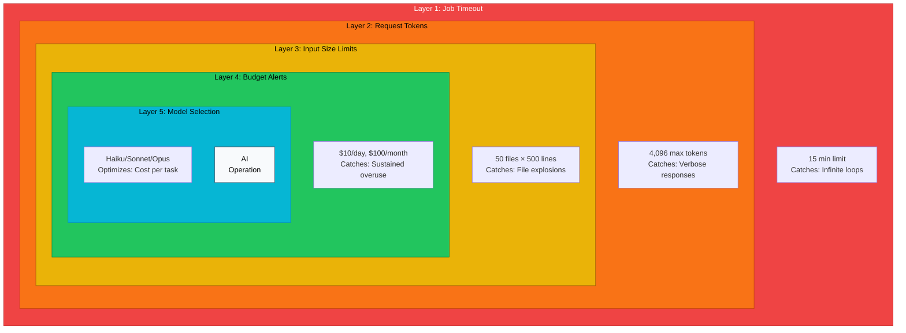
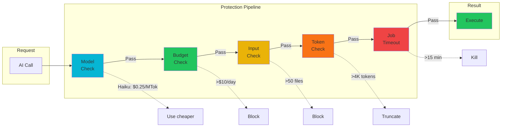
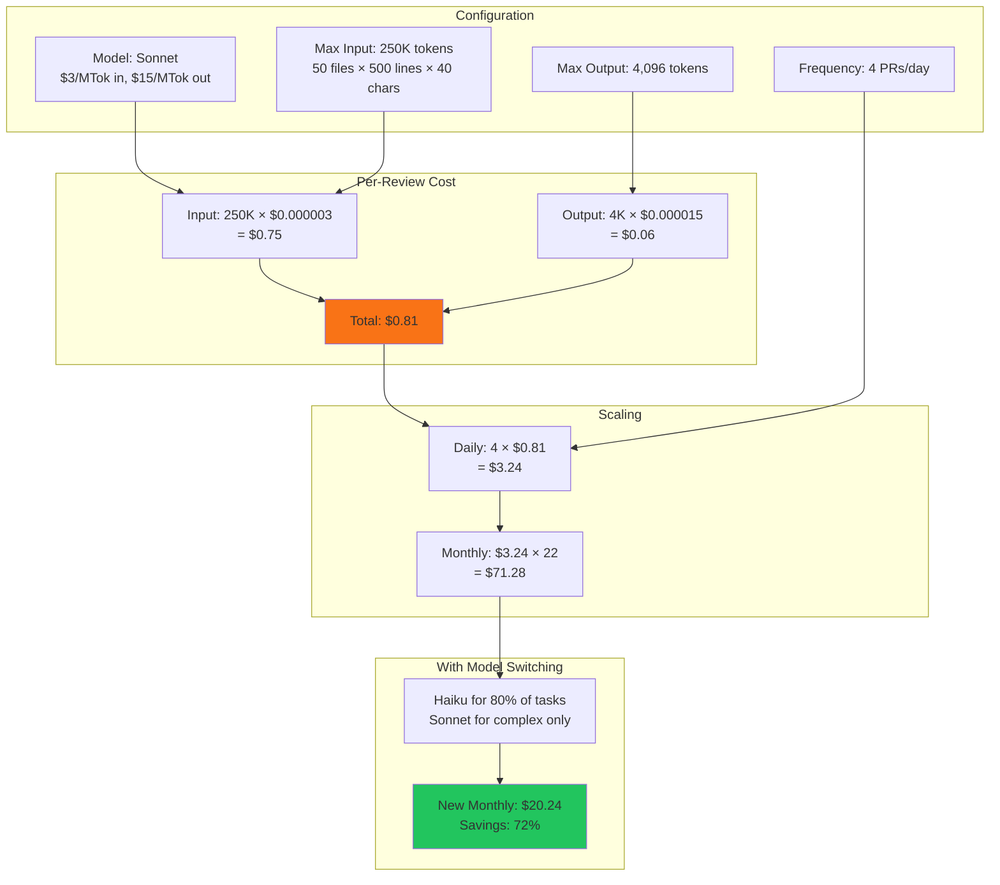
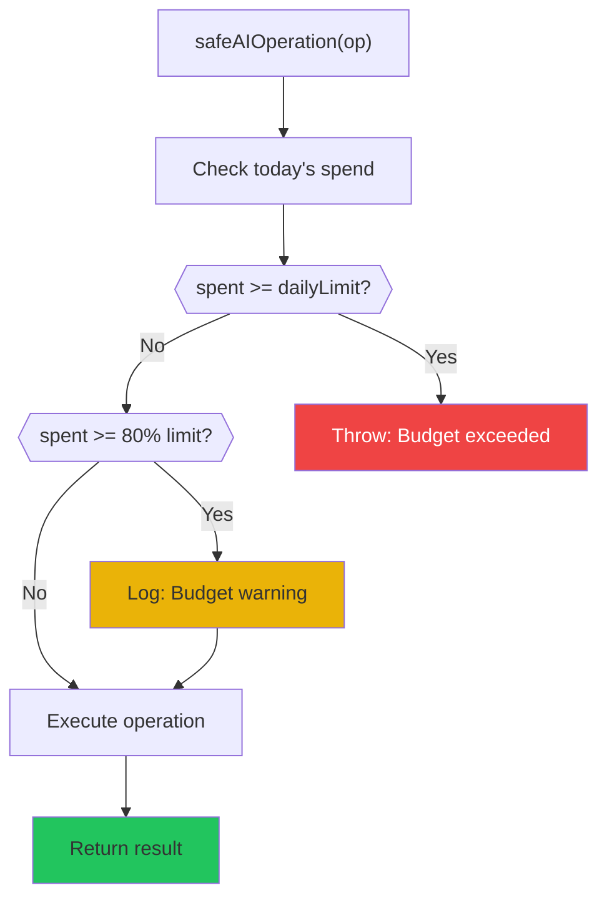
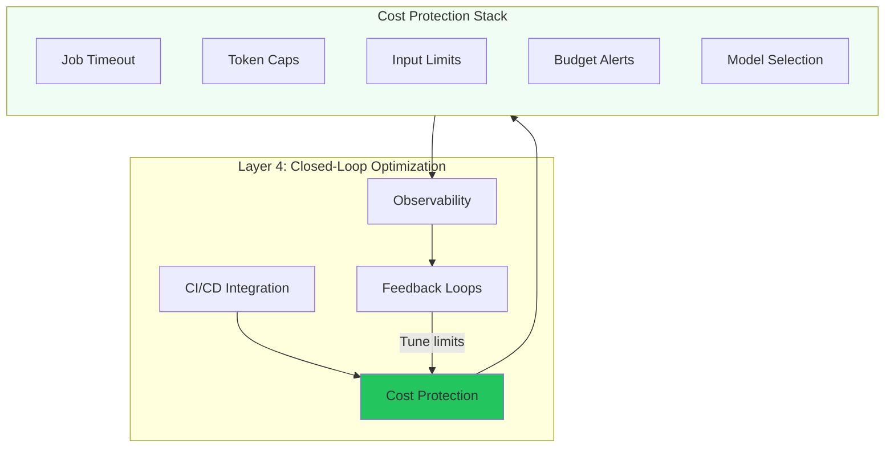

# Chapter 13: Cost Protection Layers

## Diagram Description

Visualizes the five-layer cost protection model for autonomous LLM workflows within the harness architecture. Each layer operates independently, providing defense in depth against runaway costs. Outer layers catch catastrophic failures; inner layers optimize normal operations.

## Primary View: Nested Defense Circles



## Alternative View: Linear Protection Pipeline



## Reference Table: Five-Layer Protection Model

| Layer | Protection Type | Example Limit | What It Catches | Without Protection |
|-------|----------------|---------------|-----------------|-------------------|
| 1 (Outer) | Job Timeout | 15 minutes | Infinite loops, env issues | $87+ until manual kill |
| 2 | Request Tokens | `max_tokens: 4096` | Verbose, bloated responses | $75 per 50K token response |
| 3 | Input Size | 50 files, 500 lines each | node_modules, file explosions | $234 for 150K files |
| 4 | Budget Alerts | $10/day, $100/month | Accumulated overrun | Unlimited monthly spend |
| 5 (Inner) | Model Selection | Haiku for simple tasks | Wrong model for complexity | 60x cost multiplier |

**Design principle:** Outer layers (1-2) catch catastrophic failures. Inner layers (4-5) optimize normal operations. Layer 3 prevents unexpected scale.

## Cost Calculation View



## safeAIOperation Wrapper Pattern



## Real-World Failure Scenarios

| Scenario | What Happened | Which Layer Catches It | Outcome |
|----------|---------------|----------------------|---------|
| Infinite test loop | Agent kept regenerating fixes for env issue | Layer 1: Job timeout | Killed at 15 min, $2.50 instead of $87 |
| node_modules scan | Agent processed 150K files in dependencies | Layer 3: Input limits | Blocked at 50 files, $0.75 instead of $234 |
| Verbose summaries | Agent returned 50K token analysis | Layer 2: Token cap | Truncated at 4K, $0.06 instead of $75 |
| Nightly runaway | CI job ran 200 times due to flaky test | Layer 4: Budget cap | Stopped at $10/day instead of $400 |
| Opus for grep | Used expensive model for simple search | Layer 5: Model selection | Haiku auto-selected, $0.25 instead of $15 |

## Configuration Quick Reference

```text
Layer 1: Job Timeout
  └── GitHub Actions: timeout-minutes: 15
  └── Or: setTimeout(operation, 15 * 60 * 1000)

Layer 2: Request Tokens
  └── API: max_tokens: 4096
  └── Or: response.slice(0, 4096)

Layer 3: Input Size Limits
  └── maxFiles: 50
  └── maxLinesPerFile: 500
  └── maxTotalTokens: 50000

Layer 4: Budget Alerts
  └── dailyLimit: $10
  └── monthlyLimit: $100
  └── alertThreshold: 0.8 (warn at 80%)

Layer 5: Model Selection
  └── Simple (grep, rename): haiku ($0.25/MTok)
  └── Standard (review, refactor): sonnet ($3/MTok)
  └── Complex (architecture, multi-file): opus ($15/MTok)
```

## Integration with Harness Architecture



## Usage Notes

**Where this appears:** Chapter 13, Section "Multi-Layer Cost Protection" within Layer 4: Closed-Loop Optimization.

**Key concepts illustrated:**
1. Defense in depth: five independent protection layers
2. Outer layers catch catastrophic failures (infinite loops, env issues)
3. Inner layers optimize normal operations (model selection, budgets)
4. Cost predictability through hard limits at every level

**Related chapter content:**
- ch13 lines 969-1038: Multi-Layer Cost Protection section
- ch08 Section 8.6: Circuit Breakers and Reliability Patterns
- ch15: Model Strategy and Cost Optimization

**Source material:**
- [ai-cost-protection-timeouts.md](../../../kb/ai-cost-protection-timeouts.md)
- Chapter 13 cost calculation example ($71.28 → $20.24 with model switching)
