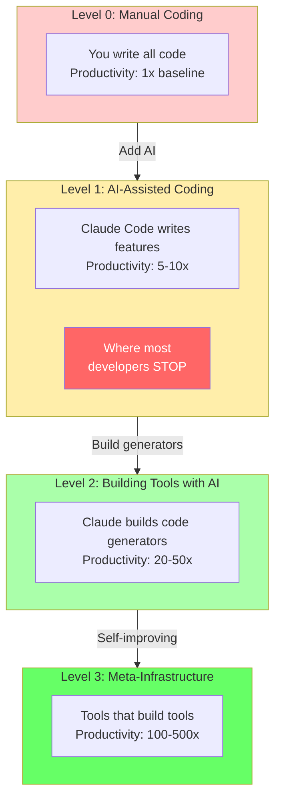
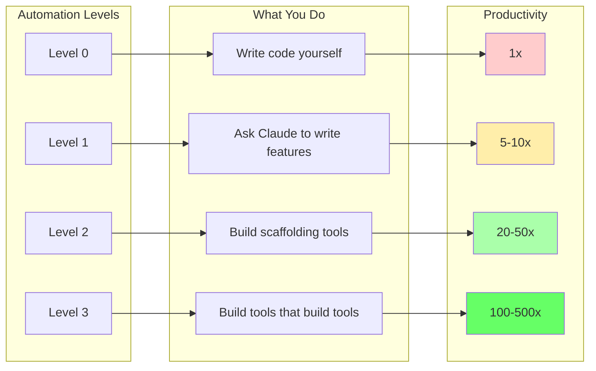
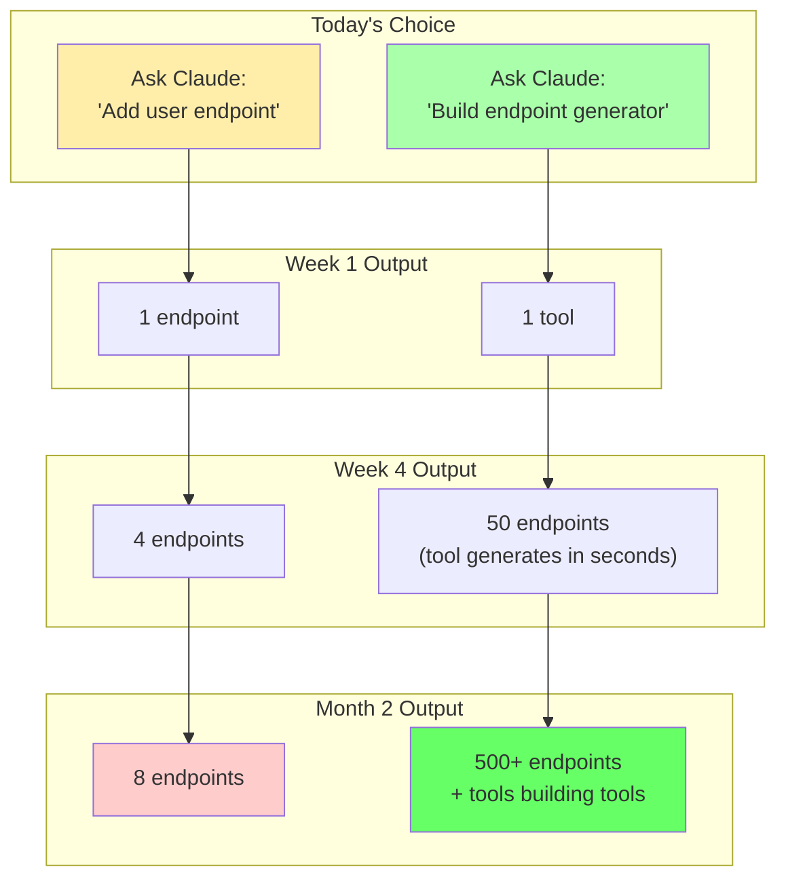

# Chapter 13: Four Levels of Automation

## Diagram Description

Visualizes the productivity progression from manual coding (1x) through meta-infrastructure (100-500x). Highlights where most developers stop (Level 1: AI-Assisted Coding) and shows the exponential returns available at higher levels.

## Primary View: Productivity Staircase

## Alternative View: Productivity Multiplier Ladder

## Alternative View: ROI Comparison Table

| Level | Activity | Example | Productivity | Investment | Most Stop Here? |
|-------|----------|---------|--------------|------------|-----------------|
| 0 | Manual coding | Write feature by hand | 1x | None | No |
| 1 | AI-assisted | "Add auth endpoint" | 5-10x | Learning curve | **YES** |
| 2 | Tool building | MCP server for CRUD | 20-50x | Days of setup | Some |
| 3 | Meta-infra | Pattern detector + generator | 100-500x | Weeks of design | Few |

**The trap**: Level 1 feels productive because it is 5-10x faster than manual coding. But it is only 2-5% of potential productivity. The real gains require building infrastructure that multiplies over time.

## Alternative View: Opportunity Cost

## Alternative View: Why Developers Stop at Level 1

| Reason | Reality |
|--------|---------|
| "It's already fast enough" | 5-10x is 2-5% of potential |
| "Tool building takes time" | Pays back in days, not months |
| "I don't know what to build" | Track repetitive prompts for 1 week |
| "My project is unique" | Patterns repeat across all codebases |
| "Just need to ship this feature" | Opportunity cost compounds daily |

**The mindset shift**: Stop measuring "features shipped today." Start measuring "capacity to ship features tomorrow."

## Usage

**Chapter reference**: Lines 433-441, "Four Levels of Automation" section

**Key passage from chapter**:
> "Level 3: Meta-Infrastructure. You build tools that build tools. A system monitors your codebase, identifies repetitive patterns, and auto-generates tools to eliminate them. Productivity is 100-500x."

**Where to use this diagram**:
- After line 441, before "Identifying High-Leverage Infrastructure"
- Primary staircase view shows progression with "STOP" callout
- ROI table provides quick reference for levels
- Opportunity cost view demonstrates long-term impact

## Related Diagrams

- ch13-signal-processing-harness.md - Failure rate reduction through layers
- ch13-harness-architecture.md - Four-layer structural view
- ch14-leverage-stack.md - What to keep sharp vs delegate vs forget
