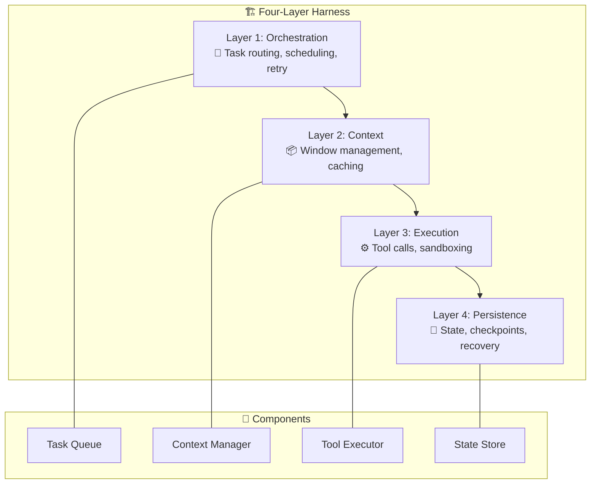
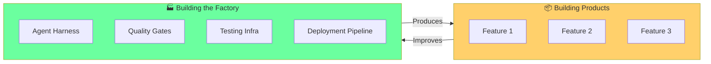

# Chapter 13: Four-Layer Harness Architecture

## Diagram Description
The four layers of a production agent harness.

## Mermaid Code

```mermaid
flowchart TB
    subgraph Harness["🏗️ Four-Layer Harness"]
        direction TB
        L1["Layer 1: Orchestration\n🎯 Task routing, scheduling, retry"]
        L2["Layer 2: Context\n📦 Window management, caching"]
        L3["Layer 3: Execution\n⚙️ Tool calls, sandboxing"]
        L4["Layer 4: Persistence\n💾 State, checkpoints, recovery"]

        L1 --> L2 --> L3 --> L4
    end

    subgraph Components["🧩 Components"]
        C1["Task Queue"]
        C2["Context Manager"]
        C3["Tool Executor"]
        C4["State Store"]
    end

    L1 --- C1
    L2 --- C2
    L3 --- C3
    L4 --- C4
```

## Building the Factory

```mermaid
flowchart LR
    subgraph Product["📦 Building Products"]
        P1["Feature 1"]
        P2["Feature 2"]
        P3["Feature 3"]
    end

    subgraph Factory["🏭 Building the Factory"]
        F1["Agent Harness"]
        F2["Quality Gates"]
        F3["Testing Infra"]
        F4["Deployment Pipeline"]
    end

    Factory -->|"Produces"| Product
    Product -->|"Improves"| Factory

    style Factory fill:#6bff9f
    style Product fill:#ffd06b
```
